**计算机组织原理学习笔记**

[TOC]

# 第一章 计算机系统与数据的运算

## 1-1 计算机系统概述

### 1-1.1 基础知识

#### 1、计算机发展与杂谈

计算机只能存储0/1，通过高低电平来存储。

软件分为系统软件（OS、DBMS、标准库等等）与应用软件。

硬件发展史：电子管（纸带+卡片时期）——晶体管（磁带）——集成电路。CPU从8位机器字长（一次整数运算所能处理的二进制位数）发展到如今的64位。至今硬件发展遵循摩尔定律。

目前的发展趋势：更微型化、更集中化两条总方向，以及更快速、廉价。

某芯片采用10nm制程——意味着该芯片内部的晶体管栅极宽度为10nm。晶体管越小，功耗越低、单位面积内晶体管数量更多（可实现更复杂的硬件功能）。

#### 2、逻辑门电路基础知识

此部分为数字电路基础补充。逻辑运算与算数运算是不同的，两者的共同点在于：都有输入和输出。

- 基本逻辑运算：与或非；
- 复合逻辑运算：与非、或非、异或、同或等。

常见门电路：

- 与 AND，或 OR， 非 NOT。
- 与非门 NAND：与运算后取反。
- 或非门 NOR：或运算后取反。
- 异或 XOR：两个输出不同时，输出1。扩展有同非门 XNOR：输出相同时输出1，也称为异或非门。


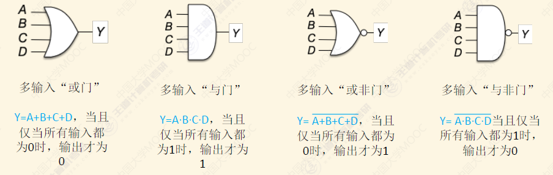

异或运算的利用：

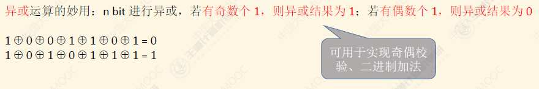

常见运算的优先级：**非 > 与 > 或**。现代门电路一般由晶体管实现。

#### 3、多路选择器和三态门

多路选择器（multiplexer，MUX）的作用：电路的“守门员”。在多个输入数据中，只允许其中一个数据通过，即n个输入一个输出。采用OP（Operation，控制信号）来控制能通过的输入。


三态门：作用也是电路的“守门员”。根据控制信号决定是否让输入的数据通过。注意和非门不同。


### 1-1.2 计算机整体工作过程与原理

#### 1、计算机结构与工作过程

计算机：组成部分仍是诺依曼架构的IO、控制器、运算器、存储器共5部分。从前运算器是中心，现代计算机以存储器为中心，一切围绕存储器展开，而**CPU**起到的是**控制器+运算器**的作用。


诺依曼架构的特点：

1. 计算机由五大部件组成。
2. 指令和数据用二进制表示，以同等地位存于存储器，都可按址寻访，但**位置大概率不同**。
3. 每条指令由若干操作码（说明是什么操作）和若干地址码（说明去哪里取）组成，数据没有操作码。
4. 必要的程序指令和数据在运行前都会被存储到主存中。
5. 以运算器为中心，现一般以存储器为中心。

以计算$y = a*b+c$为例，大致工作过程如：

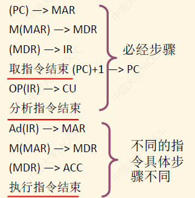

0. 使用高级语言编写取数代码，编译为机器语言后装入主存。
1. PC指向下一条要执行的指令位置0，取指完成后PC自加为1，等待本命令执行完成。
2. 指令通过地址总线放到MAR中，现在MAR = 0。
3. M(MAR) $\rightarrow$ MDR（MAR去M中找到0号地址的内容，放入MDR），导致(MAR) = 000001 000000101。
4. 由于该内容为指令，则通过总线(MDR) $\rightarrow$ IR，此时(IR) = 000001 000000101。
5. 将IR中的指令的操作码送到CU，分析后识别为取数指令。即OP(IR) $\rightarrow$ CU。
6. 由于要取数，则将该指令的地址码放到MAR中，即Ad(IR) $\rightarrow$ MAR，则(MAR) = 5，即要去5号地址寻找。
7. M(MAR) $\rightarrow$ MDR，则(MDR) = 2。取到了a的值后，放到累加寄存器，即(MDR) $\rightarrow$ ACC，(ACC) = 2。

以上完成了第0条指令，后续指令也类似。最终读取停机指令后，利用中断机制通知OS停止了该程序。

#### 2、总体工作原理与步骤

以C程序为例，从编程到可执行的程序的过程如：

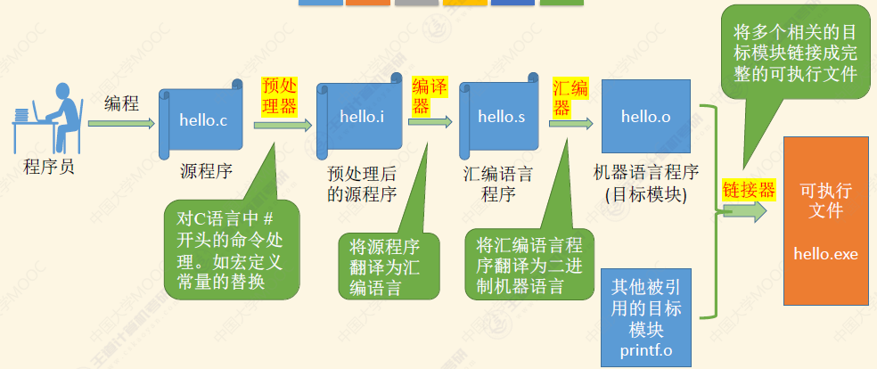

大致工作过程：

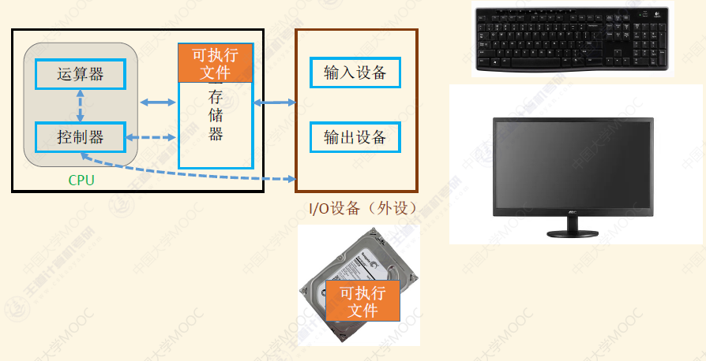

其中存储程序是重难点，其工作方式：

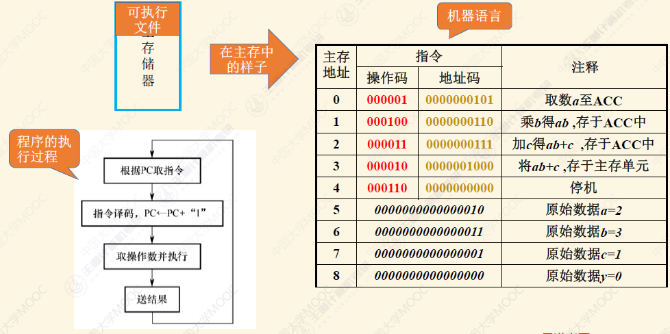


### 1-1.3 元件工作原理与计算机结构

#### 1、各元件的工作原理

主存：内有存储体、MAR（Memory Address Register，存储地址寄存器）和MDR（Memory Data Register，存储数据寄存器）。其工作原理大致可用快递驿站对比（若“寄件”，即存储数据，则是将要存的地址放到MAR，内容放在MDR，同样执行）：

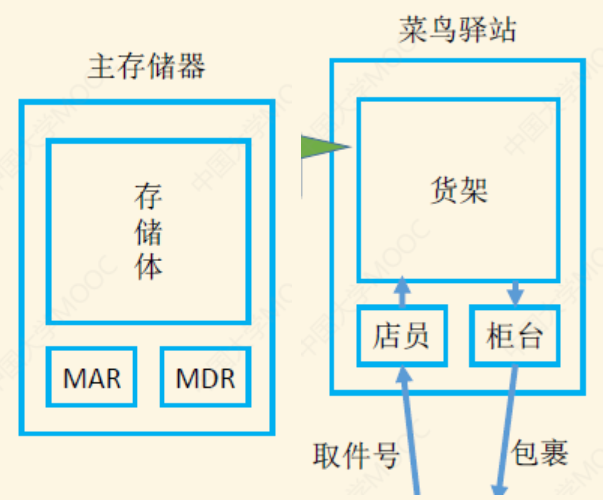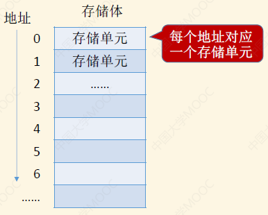

- MAR位数反映存储单元的个数，如16位则是$2^{16}$个。毕竟是存储地址的，能反映地址位数。
- MDR反映了每个存储单元的bit数，即**存储字长**。存储单位：1个字 = 2个字节（Byte）= 16bit。

运算器：实现算数和逻辑运算。内部结构如下图，另外还举例展示了加减乘除过程中各寄存器的作用：

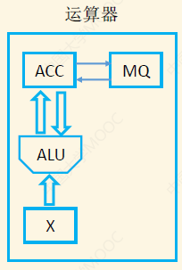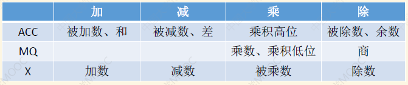

- ACC（Accumulator）：累加器，用于存放操作数，或运算结果。
- MQ（Multiplier-Quotient register）：乘商寄存器，用于存放操作数或运算结果。也会在在较大的乘除运算时辅助。
- X（indeX register）：通用的操作数寄存器，用于存放操作数
- ALU（Arithmetic Logic Unit）：算术逻辑单元，通过内部复杂的电路实现算数运算、逻辑运算。

控制器：对运算过程进行控制。

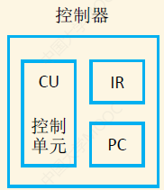

- CU（Control Unit）：控制单元，分析指令，给出控制信号。
- IR（Instuction Register）：指令寄存器，存放当前执行的指令。
- PC（Program Counter）：程序计数器，存放下一条指令地址，有自动加1功能。

#### 2、计算机系统的多级层次结构

计算机系统大致分为了高级语言机器、汇编语言机器、OS机器、机器语言层级、微指令系统（原语等）。前三部分是软件，其中OS也可以不需要，工作人员直接使用机器本身，但效率极其低下。后两部分属于传统意义上的硬件系统。


层间关系：正如OS中的“上层是下层的扩展，下层是上层的基础”。

#### 3、计算机软件

这部分在OS中很明显。


三种语言：高级语言、汇编语言和机器语言。三种翻译程序：编译器、汇编器和解释器。

- 编译器：将高级语言转换为汇编语言。汇编语言采用了助记符的方式，方便理解。部分语言的编译器直接编译为机器码，不需经过汇编器。
- 汇编器：将汇编转换为机器语言。
- 解释器：直接将源程序解释为字节码，等于汇编+编译。如JS、Python等解释型语言。区别在于，**解释型程序是执行一句翻译一句，编译程序是整体编译一次**。解释型相当于同声传译，编译型相当于文本翻译。

软件和硬件的逻辑功能等价性：同一个功能，既可以用硬件实现(性能高成本高），也可以用软件实现(性能低成本也低)。比如乘法指令。

指令集体系结构（ISA，Instruction Set Architecture)：软件和硬件之间的界面。设计计算机系统的ISA，就是定义一台计算机支持哪些指令，以及每条指令的作用用法是什么。


### 1-1.4 性能指标

存储器：

1. MAR的位数（总容量），MDR的位数（存储字长）。相乘即为总容量（一般以xB为单位）。
2. 速度。如磁盘的速度等。
3. 单位指标：K、M、G、T、P、E、Z。按1024倍递增。

CPU：较多，考一些计算题。

1. CPU时钟周期：单位为微秒($10^{-6}$)、纳秒($10^{-9}$)。
2. CPU主频、时钟频率：时钟周期的倒数，单位为赫兹。反映了一秒执行次数。
3. 执行一条指令所需的时钟周期数(CPI, Clock cycle Per Instruction)。不同的指令、工作环境、硬件等都会导致CPI变化。
4. 执行一条指令的耗时：CPI * CPU时钟周期。
5. CPU执行时间：$指令条数 * CPI / 主频$，或乘以时钟周期均可。
6. IPS(Instruction Per Second)：每秒执行的指令条数。$IPS = 主频 / 平均CPI$。
7. FLOPS(FLoating-point Operations Per Second)：每秒多少次浮点运算。


系统整体性能指标：利用基准程序（跑分软件）进行测试，可作为参考。

1. 数据通路带宽、总线带宽：指总线每次能并行传送信息的位数。
2. 吞吐量：系统在单位时间内处理请求的数量。主要取决于**主存的存取周期**（关系到信息输入内存、CPU取指、取数据和存数据、输出）。
3. 响应时间：用户向计算机发出一个请求，到计算机作出相应、获得结果的等待时间。通常包括**CPU时间（运行一个程序所花费的时间）与等待时间（用于磁盘访问、存储器访问、l/O操作、操作系统开销等时间）**。

易错：设两个CPU中，A主频高于B。

1. A一定比B快吗：不一定，看平均CPI。
2. 若A的平均CPI和B一样，那么A一定更快吗：还是不一定，看ISP等，如A不支持乘法指令。


## 1-2 数据的表示与运算元件

### 1-2.1 数据存储基础知识

#### 1、数据的存储和排列

大小端模式：即数字的存储方式。


边界对齐：

- 现代计算机通常是按字节编址，即每个字节对应1个地址。但通常也支持按字、按半字寻址，。
- 假设存储字长为32位，则1个字=32bit，半字=16bit。每次访存只能读/写1个字，则如图所示，填充则称为边界对齐。
- 给出字地址，左移1位化为半字地址，左移两位则是字节地址。

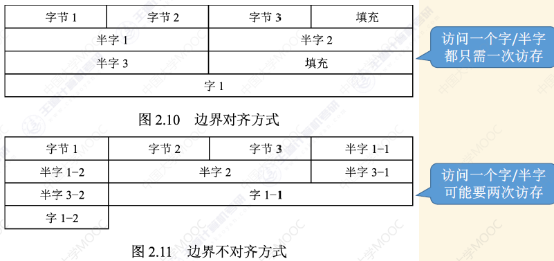

#### 2、扩展与强制类型转换

扩展的目的：ALU、X位数固定，方便进行运算，如int、char等的计算。

- 零扩展：适用于无符号数。如将一个8bit的无符号数扩展为16位。
- 带符号扩展：用符号位扩充。如负数补码用1扩充高位，正数用0。

C语言中的定点整数，除了Unsigned标识的内容，其余数据都使用补码存储。强制类型转换的3个原则分别是：

1. 无符号数与有符号数：不改变数据内容，改变解释方式。
2. 长整数变短整数：高位截断，保留低位。······
3. 短整数变长整数：符号扩展。


后两者很好理解，第一条：上图中，y的值应为61215。


### 1-2.2 数制与编码

#### 1、进位计数制

- 最古老的计数法：基于加法。如罗马计数XIII为13。
-  十进制计数：三大特点，即符号反应权重（0-9），位置也反应权重（位置靠前的更大），逢10进一。
- n进制：同样是三大特点，同上。n称为基数，用以标识每个位置用到的不同符号的个数。

除10进制外，常用的进制都是2的整次幂的，方便在计算机中存储。

常用10进制转2进制方法：利用2的整次幂来拼凑。

重要概念：真值和机器数。

- 真值：符合人类习惯的数字，如-8。
- 机器数：数字实际存到机器里的形式，正负号需要被数字化。包含**原码、反码、补码、移码**四种。

#### 2、BCD码（大纲已删）

使用4个2进制位可以表示一个十进制位，有6种冗余。修改冗余位的对应方式就可以得到不同的编码方式。

8421码：从前到后所有位的权值分别是8421。若结果落到1010以上的区间内，再加6取后4位即可，注意进一位。如：9+9 = 1 0010 = （+6进一）1000，故个位是8，十位进1为1。

在8421码的基础上，我们可以得到以下的方法：注意2421码规定5及以后的数字用1开头。

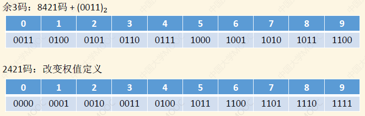

8421、2421码的各位权值都不变，而余三码没有固定权值，前者成为有权码，后者称为无权码。

#### 3、定点数的编码表示

定点数：规定了小数点在第几位，不再变化。相对应的是浮点数。

- 可用原码、反码、补码三种方式来表示定点数。还可用移码表示定点整数。
- 若真值为x，则用[x]原、[x]反、[x]补、[x]移分别表示真值所对应的原码、反码、补码、移码。


无符号数：整个机器字长的全部二进制位均为数值位，无符号位，相当于数的绝对值。

- 表示范围：$0 至 2^n-1$。可以利用等比数列的求和公式来计算其值。

原码：用第一位代表符号，后续的数值部分称为尾数，用来表示真值的绝对值。

- 规定小数点在哪一位，那么小数点的前一位就是2的0次方。
- 注意整数要将高位补上0，小数补低位。
- 设机器字长n+1位，那么原码整数表示范围是$-(2^n-1) \le x \le 2^n-1$，共$2^{n+1}-1$个数，原因是真值0有正负两种形式。

反码：若符号位是0，即为正数，反码与原码相同；否则，反码为数值位全部取反。

- 先得到原码才能得到反码，两者有一一对应的关系。
- 真值0的两种形式为 0000 与 1111（字长4位）。
- 反码只是原码转补码的中间状态，在实践中一般不用。

补码：正数的补码=原码。负数的补码=反码末位+1，即先取反再加1（考虑进位）。

- 反码负数范围比原码多1，比如1000 0000表示2的-7次方，因为真值0一定是0000，没有两种表达，节省了一个位置。
- 将负数补码转回原码的方法相同：尾数取反，末位+1。**都是先取反再加1**！

移码：补码的基础上将符号位取反。注意：移码只能用于表示整数！

- 表示范围与全整数的补码相同，都是负数多一个。
- 作用：由于负数的符号为0，那么直接对比整体的值就可以方便的比较大小，即对于A的真值比B大时，A的移码也比B大。

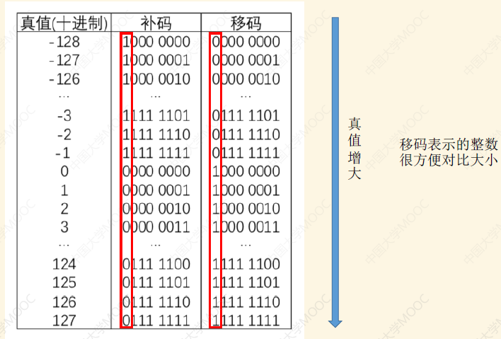

 计算技巧：

1. 对于同一个字符串，若都为负数，补码+原码=-128（8位，2的7次），反码=补码的绝对值+1。
2. 给出[x]补，求[-x]补：符号位数值位全部取反，然后末位+1。

#### 4、各种码的作用

用加法运算代替减法：利用模n除法。举例：时钟从10点要调到7点，可以正向调9个小时，因为19 mod 12 = 7。也可以负向调3个小时，这是因为 -3 = 9(mod 12)。此时，在mod 12的条件下，所有整数被分为12类，-3和9互为补数（对于mod k，n和n-k是补数）。

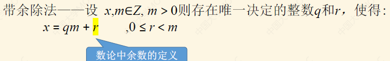

由此可知，对于一个k位字长的减法，a-b相当于a+b对2^k的补数。实际上，如果将补码看作一个有符号数的原码，那么一个数的补数就是它本身的补码。所以，如果要减去一个数，就可以变成加上该数的补码。即：补码的作用之一就是转减法为加法，省去了减法器的硬件实现。

移码的作用：方便对比真值的大小。


### 1-2.3 运算元件

#### 1、加法器

我们可以用加法器实现加减法。加法器分为1位和n位，用一个梯形来表示加法器。n个一位全加器串接，就是**串行进位加法器**。该种进位方式又称为**行波**进位，因为每一级进位消息依赖于前一级，逐级形成。


用门电路实现一位全加器：数位包括本位（正在被运算的位）、来自低位的进位、本位和。注意本位和、进位要通过异或来得出。

- 本位和：奇数个1则本位和为1。
- 进位：包含两种情况，即两个本位都是1，或者两个本位有一个1且进位也是1。

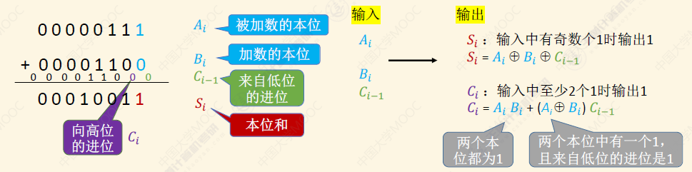

该n位加法器的不足之处：串行电路导致多位速度很慢。

#### 2、带标志位加法器和并行进位加法器

串行、并行加法器的图案是一样的，但带标志位的加法器不同。

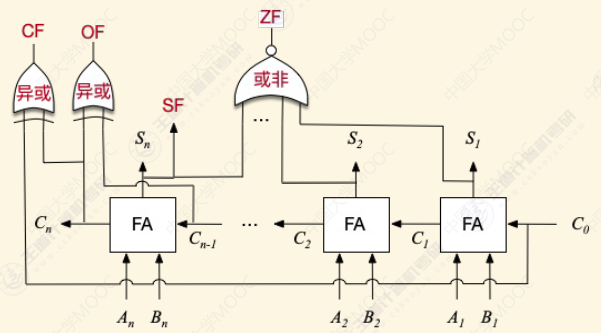

其中多了很多个标志位：

1. OF（Overflow Flag），溢出标志。判断带符号数加减运算是否溢出。**OF=1溢出；OF=0未溢出**。OF=$Cn⊕Cn-1$，即最高位和次高位的进位。
2. SF（Sign Flag）符号标志，判断带符号数加减运算结果的正负性。**SF=1结果为负；SF=O结果为正**。SF=$Sn$。
3. ZF（Zero Flag）零标志，判断加减运算结果是否为0。**ZF=1表示结果为0：ZF=0表示结果不为0**。ZF=$Sn+…+S2+S1$。
4. CF（Carry Flag）进位/借位标志，判断**无符号数**加减运算是否溢出、有进位。**CF=1溢出；CF=0未溢出**。不同符号的有符号数一定不会溢出。CF=$Cout⊕Cin=Cn⊕C0$，可以判断是否有进位（最高位有进位就溢出了）。

并行进位的并行加法器：所有进位信息都是同时产生的，几乎没有延迟。**运算速度比串行进位加法器更快**。又称为先行进位、同时进位。

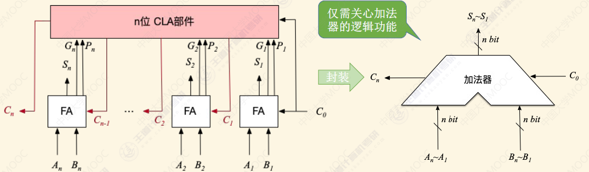

串行加法器慢的原因是，Ci依赖于Ci-1，等等。但**第i位向更高位的进位Ci可根据被加数、加数的第1~i位，结合C0即可确定**，这是一开始就有的信息，所以可以不依赖于上一级。因此，我们可以设计一个专门完成这种功能的电路模块，即CLA部件。


本方法的问题：电路会越来越复杂。改进方法：一般使用4位CLA加法器，由4个FA和不太复杂的一些线路和逻辑即可构成。

#### 3、逻辑算术单元ALU

ALU（Arithmetic and Logic Unit）。运算器接收控制器的信号后，负责处理数据。其中含有各种寄存器、ALU（核心）、PSW寄存器（程序状态字寄存器，存储状态信息，也称为标志寄存器FR，Flag Register）。由于加减乘除的基础都是加法器，所以加法器也是ALU的核心，ALU图示也和加法器类似。


ALU接收控制信号的线至少应该有m位，其中$2^m$必须比ALU的功能数多！ALU利用了MUX来控制功能。

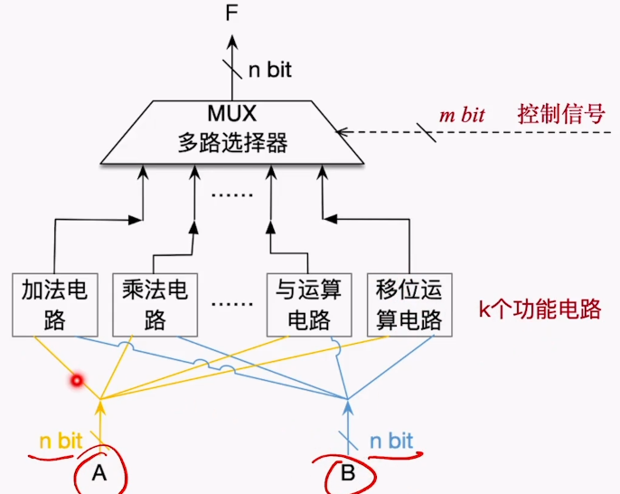

ALU同样有很多标志位，包括带标志位的加法器中的内容，一般会写入PSW。需要注意的是**ALU的运算数、运算结果位数与计算机的机器字长相同**！！很可能会因此作为信息来命题。


## 1-3 数的运算

### 1-3.1 定点数、无符号数的运算

#### 1、移位运算

移位运算即乘除以2的某次幂，是最基本的计算。首先是算术移位：

1. 原码的算数移位：符号位保持不变，仅对数值位进行移位。

   - 右移：高位补0，低位舍弃。若舍弃的位=0，则相当于÷2；若舍弃的位≠0，则丢失精度。
   - 左移：低位补0，高位舍弃。若舍弃的位=0，则相当于×2；若舍弃的位≠0，则会出现严重误差。

2. 反码的算数移位：负数的反码补的数与原码相反，但都是舍弃被挤出去的位。

   - 正数的反码与原码相同。
   - 负数右移：高位补1，低位舍弃。
   - 负数左移：低位补1，高位舍弃。

3. 补码的算数移位：**补码的右半部分同原码，左半部分同补码。**这个规律可用来转变数字。注意符号位不动！

   - 正数的补码与原码相同。

   - 负数右移：高位补1，低位舍弃。
   - 负数左移：低位补0，高位舍弃。

逻辑移位：不考虑算数上的内容，直接舍弃+补0。

循环移位：移出来的位会被放到空出来的位置。

- 应用示例：带进位位C的加法，CF也参与循环。

#### 2、定点数加减运算

计算机中，一般**只会用原码和补码进行加减运算**。带符号的数进行加减时，一定会先转换为补码！

原码加法：利用加法器实现，有正和负的四种组合情况：

- 同号相加直接加，注意可能溢出。
- 异号：用绝对值大的减绝对值小的，符号取绝对值大的。

原码减法：减数符号取反，化归为加法。

补码加法不需要考虑符号，直接加！补码减法则将减数变为负数后化归为加法。注意，**给出[x]补，求[-x]补：符号位数值位全部取反，然后末位+1。**

补码加减法溢出判断的逻辑：

- 人的判断：若正+正得负，那么上溢；若负+负得正，那么下溢。
- 方法1：利用1位符号位+逻辑电路判断。
- 方法2：利用进位情况判断。最高位的进位和符号位的进位不相同，则溢出。使用XOR电路判断“不同”。
- 方法3：双符号位法。正数00，负数11，若符号为01则上溢，10则下溢。但实际存储时只存储1个符号位，运算时会复制一个符号位。双符号位补码即模4补码，单符号为补码是模2补码。


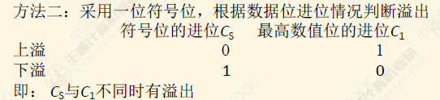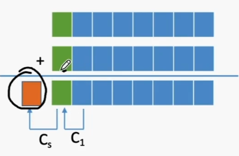

#### 3、无符号数的加减运算

无符号数肯定是原码。加法就直接相加；减法中，减数按位取反、末位加一，然后减法变加法，按位相加。

溢出判断：

- 无符号数加法的溢出判断：最高位产生的进位=1时，发生溢出，否则未溢出。
- 无符号数减法的溢出判断：减法变加法，最高位产生的进位=0时，发生溢出，否则未溢出。


### 1-3.2 原码乘除法运算

#### 1、乘法思想

手算乘法的错位相加实际上模拟的是乘以10的负次方，保证小数点对齐。二进制的手算更加简单，因为数位只会是1或0。

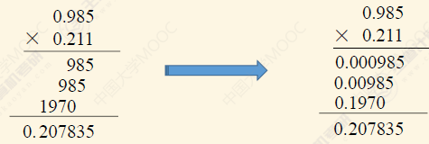

此处有一个问题：两个n位数相乘最多会得到2n位，寄存器可能保存不下；另外，手算的过程中，每一次位积都要记录，而寄存器空间不足（利用数位只能是1和0解决）。

#### 2、原码一位乘法

原码的一位乘法：利用MQ、X和ACC实现，此处ACC存放乘积高位，MQ存放乘积低位，X存放被乘数。实现思路是：**先加法再移位，重复n次！**

1. 符号位异或得最终符号位，剩余部分绝对值相乘。
2. 一开始的运算器中，MQ存放乘数，ACC清0，X存放被乘数。
3. 从MQ的最低位开始，若当前位是1则ACC加上被乘数；位是0则ACC不变。
4. 逻辑右移，ACC补0，即下图的图3。
5. 继续利用MQ的最低位进行乘法，ACC内容+乘数，继续右移，持续n次（此时n=4，最高位是符号位不参与）。
6. 最后，首位变成符号位，去掉最后一位符号位，得到一个8位数值。

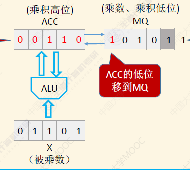

为方便记忆，原码乘法可以写成双符号位。

#### 3、除法思想

手算的思想：每一次都上一个不超过被除数的最大数值。

规律：忽略小数点；每确定一位商，进行一次减法，得到4位余数；在余数末尾补0（左移），再确定下一位商。确定n位商即可停止（机器字长为n）。

实现：利用ACC存放被除数，后期存放余数；MQ存放商；X存放除数。

#### 4、原码除法——恢复余数

>手算时，ACC和X比较大小确定商1或0（商 = ACC>X ? 1 : 0）。但本方法中，默认先商1，如果不正确再商0，并**恢复余数**。

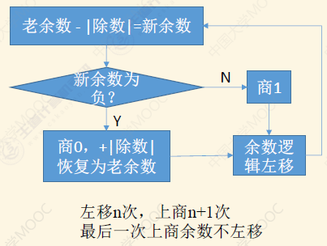

实现方法为：判断大小，上商0/1，得到余数，余数逻辑左移末尾补0。开始之前，先把x、y绝对值的原码和补码写出备用。

1. 符号单独处理，即为两符号的异或。
2. ACC存被除数，X存除数，MQ存商，MQ置0（区分：乘法一开始是ACC置0）。如下图1。
3. 先商1，然后ACC-除数，即$ACC+[-|y|]补$。若首位为1，那么说明结果为负，不够减，要恢复余数，即现在把余数加回去。之前是减y，现在$ACC+|y|$，将ACC的内容覆盖，就恢复到了没有减的时候。
4. 上一次的余数和MQ统一进行逻辑左移，如图3。
5. 继续进行n次，n为机器字长，在下面的例子中为5。
6. 最后，MQ中存的是商，ACC中存的是余数。如果最后的ACC中余数也是负，那么也需要恢复。
7. 余数还需要逻辑右移n-1位（图中为4位）才是真实的余数。


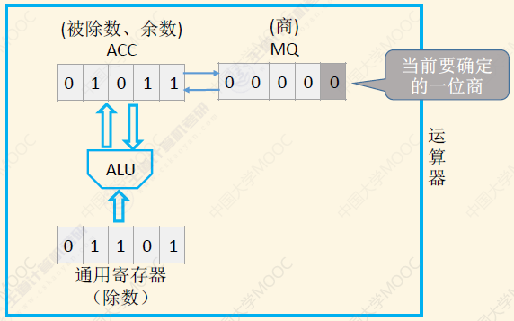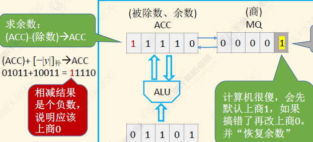

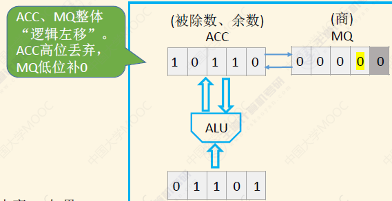

#### 5、不恢复余数除法

对恢复余数进行优化，得到不恢复余数法，或称加减交替法。当我们在恢复余数除法中，余数a为负，就要改商为0并加y。如下图。


经过运算后，我们发现这一步骤可以简化为2a+b，即：a若为负，直接商0然后余数逻辑左移一位，再加上除数b。

正数处理和恢复余数法相同，即先左移再减除数。

**进行加法的次数：进行n+1次加法（减法），左移n次；如果最后余数为负，还是需要加一次，那么就有n+2次。所以可能是n+1也可能是n+2。**

>可以看到，每次都要逻辑左移，但如果老余数为负那么加余数，为正那么减余数，故称加减交替。

这种方法要稍微记忆，因为不符合思维习惯；但是，此法明显更简便。


### 1-3.3 补码加减乘除运算

#### 1、补码加减法运算电路

在对普通加法器进行扩展后，就得到了支持补码加减的运算电路：


1. MUX中的信号。0代表进行加法，Y为加数；1代表进行减法，Y为减数。
2. 加法则按位相加，减法则取反+1换成加法。在电路中的体现是：Y按位非（图中的非门），然后最后相加的结果再加OP信号。

以上电路也可用于无符号数加减，减法也是取反+1。

扩展：现将OF（溢出）、SF（符号）、ZF（0）、CF（进位）四个标志位也加入该加法器。

#### 2、补码乘法

原码一位乘法：

- 进行n轮（加法、移位）。
- 每轮要么加被乘数，要么加0。
- 逻辑右移。
- 符号位不参与运算。

补码一位乘法：

- 进行n轮（加法、移位），最后再多来一次加法。
- 利用辅助位来确定加什么。
- 算数右移，即负数高位补1。
- 符号位必须参与运算，在最后一次加法。

下图是补码乘法的硬件构成，包含一个辅助位在MQ后、双符号位在ACC和X前，每个寄存器都有n+2位。辅助位运算规则：

1. 辅助位-MQ中最低位=1时，（ACC）+ [x]补。
2. 辅助位-MQ中最低位=0时，（ACC）+ 0。
3. 辅助位-MQ中最低位=-1时，（ACC）+ [-x]补。一般会有专门的辅助电路。

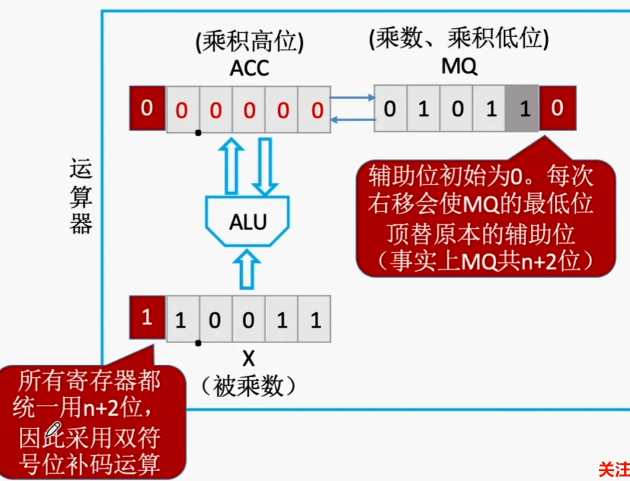

补码一位乘法的算法称为Booth算法。

1. 首先将乘数放在MQ，辅助位置0，双符号位复制符号。
2. 使用辅助位 - MQ最低位，根据得到的值，将x的补码与ACC相加。
3. 相加完，符号位不动，数值位算术右移（即符号位是什么就补什么）。
4. 一直重复n次，此处n=4。
5. 最后，再进行一次算数右移并按规则与ACC相加。
6. 现在我们得到了双符号的补码结果，取反+1即可。

#### 3、补码除法的实现

在原码中，我们利用两种除法方式进行计算，而补码除法只能使用加减交替法，特点是：

- 符号位参与运算，不采用绝对值。原码中第一次一定是减，但补码中要看符号。
- ACC存被除数/余数、X存除数，它们采用双符号位。
- 与乘法相比，不需要辅助位。
- 末位恒置为1。

开始之前，我们需要写出：被除数x，y的真值；x的补码，y的补码，-y的补码。步骤如下：

1. 若xy符号相同，则ACC为被除数 - 余数，即 + -y的补码。xy异号，则加上除数。
2. 下面n次都一样：ACC中存的余数和除数同号则商1，异号商0。
3. 差别：最后一次不需要再加减，而是末位商直接置1，省事，不需要管恢复余数！误差不超过$2^{-n}$。

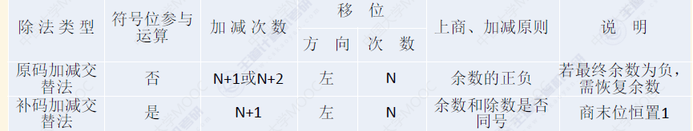


### 1-3.4 浮点数

#### 1、浮点数的表示

由于定点数的范围和精度都不足，所以考虑引入指数来表示数字。浮点数由阶码E（ 阶符表示指数的正负+阶码数值部分）与尾数组成，相当于一个科学计数法数。

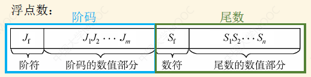

阶码E反映浮点数的表示范围及小数点的实际位置；尾数M的数值部分的位数n反映浮点数的精度。

- E一般用补码或移码（方便比较大小），M一般用补码或原码。移码不能表示整数！！！
- 为了防止溢出影响，一般都会采用双符号位。
- 尾数是定点小数，最大值为0.1111，最小值0.1000。注意不是0.0001，后者会被规格化。


规格化浮点数：规定尾数的最高数值位必须是一个有效值，不能是0开头。**溢出右规，不足左规**。

- 左规：当浮点数运算的结果为非规格化时，要进行规格化处理，将尾数算数左移一位，阶码减1。
- 右规：当浮点数运算的结果尾数出现溢出（双符号位为01或10）时，将尾数算数右移一位，阶码加1。


#### 2、IEEE754标准

规定阶码使用移码表示，方便比较大小（当偏置值为128时，FF表示-128，FE是127，故8位移码表示范围是-128 到 127，全1是-128，全0是-127）；尾数使用原码表示，隐含1.xx。即尾数最小认为是1。


在标准中，全0和全1阶码都有特殊含义，不能使用；且**偏置值为127**（真值要减去127），即0000 0001代表-126，1111 1110代表+127。

>因此，规格化单精度数的绝对最小值是2的-126次方，尾数最小就是0000 0000（认为是1.0），故最小能规格化表示的正数是2的-126次方。
>
>但是IEEE标准中，也允许非规格数来表示比$2^{-126}$更小的数。当阶码全0，尾数非0，认为是非规格化小数，此时隐含的1.x变成0.x，因此最小值应当是$2^{-126} * 2^{-23}$，即尾数为0.00···001。

除阶码全0、尾数非0的情况之外，还有3种阶码为0或1的特殊情况。

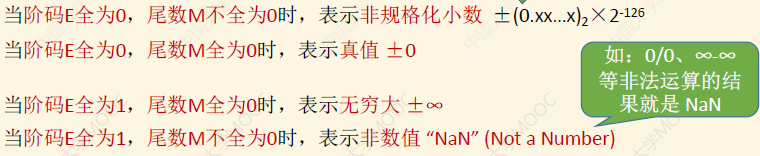

#### 3、浮点数的加减运算

非IEEE的标准中，长度不同，更重要的是尾数不会隐含1；另外要看清楚是补码规则还是原码规则。

5步运算步骤：

1. 对阶。将阶数小的向大的对齐（加减法损失小精度）。
2. 尾数相加减。是原码加减法。
3. 规格化，左规或者右规。一般来说向大对齐都不会出现首位为0，反而可能出现溢出。所以一般进行的是右规。
4. 舍入。舍去无效尾数。
5. 看溢出。看阶码是否溢出。


舍入有多种规则，如多余的直接砍掉、四舍五入、0舍1入、恒置1法等，但如果有入可能会导致溢出，反而损失精度。

#### 4、浮点数的强制类型转换


无损转换：float转double，char转int转long转double都不会损失。任何数转double都不会损失。

另外，有损无损主要看看尾数的位数，如同为32位的int转float可能损失精度，但不会溢出。float转int可能会溢出，也可能会损失精度。在32位条件下：

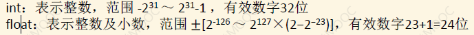


# 第二章 存储系统

## 2-1 存储器与主存

### 2-1.1 存储器

主存、Cache是CPU唯二能直接访问的存储。（寄存器不算存储设备）


存储器的功能：存放二进制信息。

- 按介质分可分为半导体存储器、磁表面存储器和光存储器。
- 按信息的可保存性：
  1. 断电后，存储信息消失的存储器——易失性存储器（主存、Cache）；断电后，存储信息依然保持的存储器——非易失性存储器（磁盘、光盘）。
  2. 信息读出后，原存储信息被破坏——破坏性读出（如DRAM芯片，读出数据后要进行重写）；读出后，原存储信息不被破坏-—非破坏性读出（如SRAM芯片、磁盘、光盘）。
- 按信息的可更改性：
  1. 读写存储器（Read/Write Memory），即可读也可写（如：磁盘、内存、Cache）。
  2. 只读存储器（Read Only Memory），只能读不能写（如：实体音乐专辑通常采用CD-ROM，实体电影采用蓝光光碟，BIOS通常写在ROM中）。
- 按存取方式分，可分为以下几种；最后两种称为串行访问存储器。
  1. **可按内容检索的相联存储器**（CAM），如快表；
  2. 随机存储存储器（RAM），读写任意存储单元所需时间都相同；
  3. 顺序存储存储器（SAM），读写单元时间取决于其物理位置，如磁带；
  4. 直接存储存储器（DAM），既有随机存取特性，也有顺序存取特性。先直接选取信息所在区域，然后按顺序方式存取。


存储器的性能指标：

1. 容量 = 存储单位数 * 字长。MDR位数反映了字长。
2. 存储速度：数据传输率 = 数据宽度/存储周期。取出速度算法相同。数据宽度即存储字长！
3. 存取时间：Ta，指从启动一次存储器操作到完成该操作所经历的时间，分为读出时间和写入时间。
4. 存取周期：Tm，又称读写周期或访问周期。它是指存储器进行一次完整的读写操作所需的全部时间，即连续两次独立地访问存储器操作（读或写操作）之间所需的最小时间间隔。
5. 主存带宽：又称数据传输率，表每秒从主存进出信息的最大数量，单位为字节/秒或位/秒等。


### 2-1.2 主存

#### 1、主存的基本组成

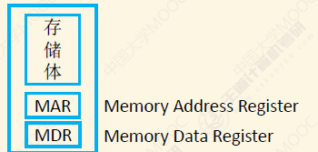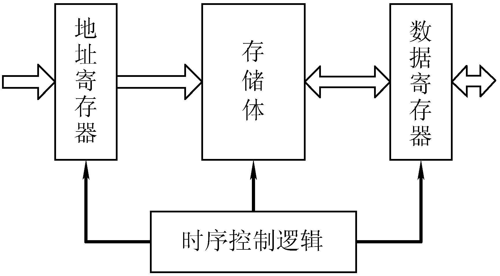          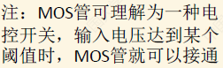 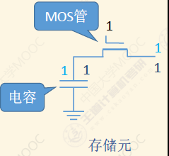

主存可看做由MAR+MDR+存储体组成。

- 存储体由存储单元构成，包括多个存储元。高电平为1，低电平为0。读出时放电有电流则为1，无电流则为0。
- 存储器每次读写的单位都是和字长相同，等于每行（一个存储单元）中存储元的个数，也等于MDR的位数，也是$log_2 MAR$。
- 每个存储单元是一个地址，对应译码器的一条**字选线**，是横向的；纵向有位线来选择特定位的数据。选择每片存储芯片的线称为片选线。
- 由于MAR的电信号可能不稳定，所以要加上控制电路，待稳定再发出。片选线连着控制电路，CS（Chip Select）或者CE（Chip Enable）。若加上否定的上划线，表示该信号低电平有效。
- 控制电路还连接着读写控制线，WE表示允许写，OE表允许读。若只有一根读写控制线，那么WE上划线表示低电平写，高电平读。


另外，一般译码器后有译码驱动，保证输出的电信号稳定有效；内部的位选线和字选线都属于内部读写电路。

常见大小描述：

- 8K×8位，即$2^{13}$×8bit，共8KB；
- 8K×1位，即$2^{13}$×1bit，共8Kb=1KB。
- 64K×16位，即$2^{16}$×16bit，共1 Mb = 128 KB。

寻址简介：

- 有多少个单元，就有$log_2n$向上取整根地址线。
- 可以按字（4B），按字节（最常用，默认），半字、双字等寻址。

#### 2、SRAM和DRAM

Dynamic Random Access Memory即动态RAM，Static Random Access Memory即静态RAM。通常DRAM用于主存、SRAM用于Cache，考试常从两者不同点来考察。


对比两者的最大不同：存储元不同。

- DRAM使用栅极电容存储信息，读出就把电流放出，所以是破坏性读出，需要读后重写，称为“再生”。故读写更慢。
- SRAM使用双稳态触发器存储信息。上图中，规定A高电平B低电平为1，反之为0。读出也需要两根数据线，某根线输出低电平说明为0或1。

对比信息的存储等其他方面：

- DRAM每2ms就要给电容重新充电，称为刷新。成本低，集成度高，功耗低。
- SRAM有6个mos管，内部电荷可以认为不会丢失，不需要刷新。但需要注意的是，虽然SRAM不用刷新，但仍是断电易失的存储器。成本高，集成度低，功耗高。

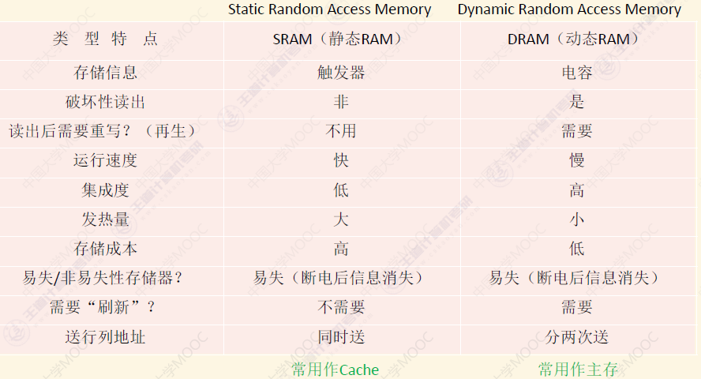

#### 3、DRAM的刷新

我们知道每个译码器要和一个单元相连的话，会让地址线太多。所以，实际中一般会将存储单元二维排列而非简单的线性排列。此时如果有$2^n$个存储单元，就可以拆分为$2^{n/2}$的方阵来存储，行地址和列地址都可以只需要$2^{n/2}$根选通线。如16*16的矩阵就需要$2^5$根。

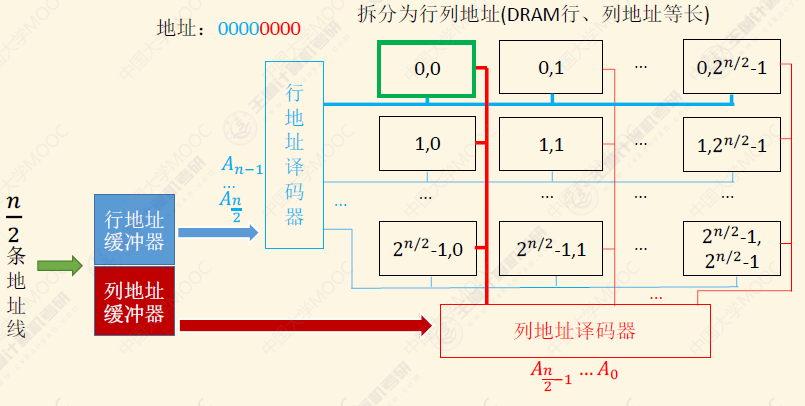

DRAM刷新的问题解答：

1. 刷新周期：一般为2ms。
2. 每次刷新多少存储单元：每次一行，如上图，一般是$2^{n/2}$个。
3. 选用什么样的地址译码器：行列地址译码器。
4. 如何刷新：有专门硬件支持，读出信息后重新写入，占用一个读写周期。

据此，如果DRAM内部是128*128的，那么读写就需要128个周期，所以应当安排刷新方式、刷新时机。以读写周期0.5us为例：

1. 分散刷新：每次读写完都刷新一行，系统的存取周期变为1us，一般是不可接受的，因为性能变慢了百分之百。
2. 集中刷新：集中安排时间全部刷新，系统的存取周期还是0.5us。会造成有一段时间无法访问存储器，称为访存“死区”。
3. 异步刷新：只要在2ms内每行刷新1次即可，128次刷新请求每隔2ms/128=15.6us一次，即每15.6us内有0.5us的“死时间”。但实践中，译码也要耗时间，可以在译码阶段刷新。相对是最常用的。

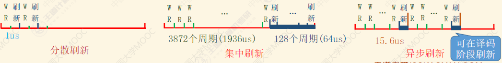

#### 4、ROM和RAM

RAM芯片有易失性，断电后数据消失；ROM芯片有非易失性，断电后数据不会丢失。**两者结合才是完整的主存**，且统一编址，当作一个整体使用。

- 通常计算机运行的资源都是存在RAM中，断电即失。
- BIOS芯片的自举装入程序、硬盘中的信息都是存储在ROM的。

下面是各种RAM的介绍：

1. MROM（Mask Read-Only Memory）：掩模式只读存储器。
   - 厂家按照客户需求，在芯片生产过程中直接写入信息，之后任何人不可重写。
   - 可靠性高、灵活性差、生产周期长、只适合批量定制。
2. PROM（Programmable Read-Only Memory）：可编程只读存储器。
   - 用户可用专门的PROM写入器写入信息，写一次之后就不可更改。
3. EPROM（Erasable Programmable Read-Only Memory）：可擦除可编程只读存储器。
   - 允许用户写入信息，之后用某种方法擦除数据，可进行多次重写。
4. UVEPROM（ultraviolet rays），用紫外线照射8~20分钟可擦除所有信息。
5. EEPROM（也称为E2PROM，第一个E是Electrically）用“电擦除”的方式，可擦除特定的字。
6. Flash Memory：闪速存储器，即闪存。
   - 在EEPROM基础上发展而来，断电不丢失信息，且可多次快速擦除重写。每个存储元只需1个MOS管，位密度比RAM更高。
   - U盘、SD卡就是闪存。
   - 由于闪存需要先擦除再写入，因此闪存的“写”速度要比“读”速度更慢。
7. SSD（Solid State Drives）：固态硬盘。
   - 通常由控制单元+存储单元（Flash芯片）构成，与闪速存储器的核心区别在于**控制单元不一样，但存储介质都类似**，可进行多次快速擦除重写。
   - SSD速度快、功耗低、价格高，目前个人电脑上常用SSD取代传统的机械硬盘。
   - 拓展：虽然手机辅存也使用Flash芯片，但相比普通SSD，集成度更高、功耗更低、价格更贵。


### 2-1.3 主存与CPU的连接

#### 1、存储芯片与CPU的连接

CPU通过控制电路来控制单块存储芯片。另外，现代计算机MAR、MDR通常集成在CPU内部。存储芯片内只需一个普通的寄存器（暂存输入、输出数据）。现在提出问题和一些思路：

- 数据总线宽度>存储芯片字长，怎么办？——位扩展。
- 主存字数太少，要扩展主存字数怎么办？——字扩展。

现代计算机中的主存中，通常含多块存储芯片。

位拓展指：**CPU数据总线宽度未利用完全**，CPU数据位数>主存，于是将多个主存芯片和CPU连接。下面是位扩展的例子：8k * 1位的芯片如何与地址位数16位、数据位有8位的CPU连接？

- 数据总线每片连1个，因为每片只需要一条线。
- 地址总线只需要使用13位，因为每块都是$8Kb = 2^{13}b$，同时将信号发给所有芯片。
- 拓展后，8个1位的芯片被拓展为了1个8位的。


字拓展指：**CPU中地址总线宽度未利用完全**。现在我们将上面的一堆芯片看成$8Kb * 8$的一块芯片，但还有3根地址总线没有利用完全。我们将它们作为片选信号：

- 线选法：多根线只有一个能为1，此种字拓展法称为线选法，n条多余的地址线只能对应n个选片信号。
- 译码片选法：增加一个译码器，那么n条多余的线就可以对应$2^n$个选片信号。用“a-b译码器”表示a根输入线，b个有效信号，b一定不大于$2^a$。

如果我们采取译码器片选法，那么就可以连接8个这样的芯片，字长就被拓展到了64K。

此处需要注意图中的控制信号是CS还是CS否定；前者表示1是启用，后者表示0是启用。

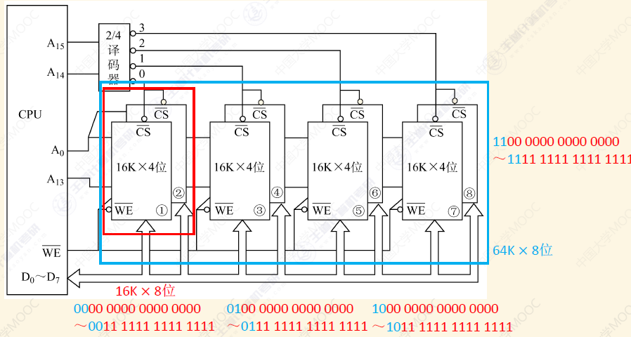

上图是字位同时拓展的芯片实例，4个16K4位的芯片被位扩展为16K8位，又被字扩展为64K8位。


#### 2、译码器知识补充

根据芯片的控制信号的高低电平，要选择不同的译码器。通用译码器芯片会有一个使能端（EN）信号，启用表示会对结果取反，可以适用于两种不同的存储芯片。

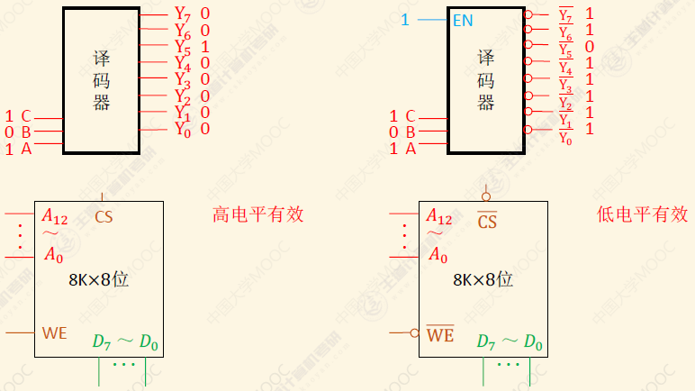

另外，译码器不可能总是工作，应当只有在CPU发出请求后才工作。所以会有多个使能信号，如下图中G2B与CPU的MREQ（Memory Request，主存工作请求信号），该信号说明CPU需不需要译码器工作。如果该信号说明需要，CPU回显送出地址信号到MAR，译码器才会去读取MAR中的地址信息，否则全0或全1不工作。


结合下图可以大致知道CPU和主存连接过程：

1. CPU发出MREQ信号，在MAR中输入了地址。
2. 待地址稳定有效后，译码器读出并给对应的芯片发出CS信号。
3. 芯片接收到信号后将数据放到MDR，通过数据总线发回给CPU。同样需要等待数据稳定。
4. 最后，MDR中的数据失效。

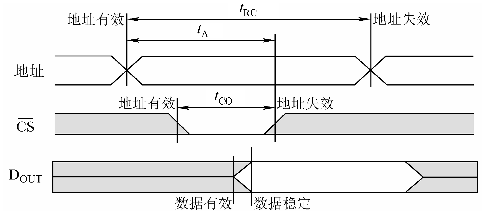

#### 3、双端口RAM（不在大纲内）

多核CPU访存等待恢复时间太长；CPU比主存快太多，等待时间太长；两者都不可接受，所以只能进行改进。

改进方式之一是双端口RAM。只需了解即可。


需要有两组完全独立的数据线、地址线、控制线。CPU、RAM中也要有更复杂的控制电路。只要两者访问不同地址，就可以不发生冲突。另外两者一起读没问题，不可以一起写、一读一写（写加写锁）。


#### 4、多模块存储器

考试重点之一。即使是单核，CPU比主存快太多，等待时间太长，而恢复时间不可避免，所以可以用多体并行，用多个内存条一起。多个内存条的协作方式也不同，可以分为：

1. 高位交叉编址：采用首几位来区分内存条。即01001下一个是01010。如：插入两根内存条，但是单通道。
2. 低位交叉编址：采用末几位来区分内存条。即01001下一个是01101。两根双通道内存条。

确定编址方式后，就可以根据地址来得出某个地址的具体位置了。当然要知道有几个存储体。

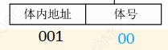

现在设每个存储体存取周期为T，存取时间为r，且假设T=4r。要连续访问00000,00001,00010,00011,00100共5块内容。

- 若高位交叉编址：每块读取都是T才能接着读，总共读取时间5T = 20r。
- 若低位交叉编址：第一块读完要读第二块，所以不用等待第一块恢复，可以直接读，于是5块只需要4r+T = 9r的时间。

可见，低位交叉编址宏观上读写一个存储单元的时间接近r。

        

多少个存储体最好：最好如上例中，T = kr则取k个，可实现“流水线”不间断存储。

另外一种多模块存储器：单体多字存储器。类似进行位扩展。比交叉编址的差一些。**注意总线宽度也要拓展**！


## 2-2 辅存（外存）

#### 1、磁盘

存储原理：磁表面存储器的表面有磁粉，通过线圈的电磁转换完成读写操作。如使用N-S代表1，S-N代表0等。

主要优点：非破坏性读出，不易失；缺点：结构复杂，速度慢。


物理构造：

- 盘面：一块硬盘含有若干个记录面，每个记录面划分为若干条磁道，而每条磁道又划分为若干个扇区，扇区（块）是磁盘读写的最小单位，即磁盘按块存取。
- 磁头数：一个磁头读写一个记录面。
- 柱面数：表示硬盘每一面盘片上有多少条磁道。在一个盘组中，不同记录面的相同编号（位置）的诸磁道构成一个圆柱面。
- 扇区数：每条磁道上有多少扇区。注意，磁盘每条磁道长度不同，但扇区数相同，外圈有未利用处。
- 其他部件：驱动器、马达、控制器等。

磁盘地址：

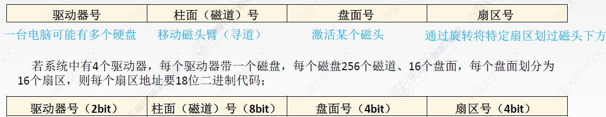

硬盘属于机械式部件，其读写操作是串行的，不可能在同一时刻进行两重操作。

#### 2、磁盘性能指标

性能指标：

1. 容量：一个磁盘所能存储的字节总数称为磁盘容量。磁盘容量有非格式化容量和格式化容量之分。
   - 非格式化容量指磁记录表面可以利用的磁化单元总数。
   - 格式化容量是指按照某种特定的记录格式所能存储信息的总量。不同格式容量也不同。
2. 记录密度：记录密度是指盘片单位面积上记录的二进制的信息量，通常以道密度、位密度和面密度表示。
   - 道密度：沿磁盘半径方向单位长度上的磁道数；如60道/cm。
   - 位密度：磁道单位长度上能记录的二进制代码位数；如600bit/cm。
   - 面密度 = 位密度和道密度的乘积。
   - 注意：磁盘所有磁道记录的信息量一定是相等的，并不是圆越大信息越多，故每个磁道的位密度都不同。
3. 平均存取时间 = 寻道时间（磁头移动到目的磁道）+ 旋转延迟时间（磁头定位到所在扇区）+ 传输时间（传输数据所花费的时间）。
4. 数据传输率：在单位时间内，能向主机传送数据的字节数。

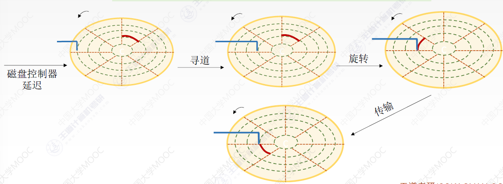

#### 3、RAID

RAID（Redundant Array of Inexpensive Disks,廉价冗余磁盘阵列）是将多个独立的物理磁盘组成一个独立的逻辑盘，数据在多个物理盘上分割交叉存储、并行访问，具有更好的存储性能、可靠性和安全性。其分级如下：

在RAID1~RAID5的几种方案中，无论何时有磁盘损坏，都可以随时拔出受损的磁盘再插入好的磁盘，而数据不会损坏。

1. RAID0：无冗余、无校验；将逻辑上相邻的两个扇区在物理上存到两个磁盘，类比“低位交叉编址的多体存储器”。理论最快但不安全。
2. RAID1：镜像磁盘阵列。存两份数据。最可靠但代价不可接受。
3. RAID2：采用海明码；逻辑上连续的几个bit物理上分散存储在各个盘中4bit信息位 + 3bit海明校验位——可纠正一位错，发现两位错。存储效率4/7。
4. RAID3：位交叉奇偶校验的磁盘阵列。
5. RAID4：块交叉奇偶校验的磁盘阵列。
6. RAID5：无独立校验的奇偶校验磁盘阵列。

#### 4、SSD

- 原理：基于闪存，是电可擦除（EEPROM）的介质。
- 特点：高价，相对来说读快写慢；不易损坏，能耗低。重要：每个块有理论寿命，而机械硬盘理论寿命无限。
- 读写单位：不是磁盘的块、扇区，而是页。多个页组成块。
- 擦除单位：以块为单位擦除。如果要擦除某个页，先把其余内容复制，擦除后再拷贝回来。被擦除干净后的块，每个页可被写一次，读无限次。
- 访存：SSD支持随机访问，给定一个逻辑块号可以迅速定位到物理地址。

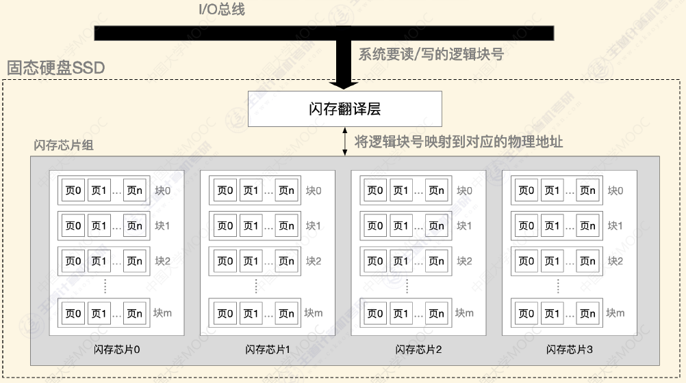

磨损均衡技术和思想：将擦除平均分布到各个块上，提高寿命。

- 动态磨损均衡：写入数据时，优先选择累计擦除次数少的新闪存块。
- 静态磨损均衡：SSD监测并自动进行数据分配、迁移，让老旧的闪存块承担以读为主的储存任务，较新块承担更多的写任务、

>例题：某固态硬盘采用磨损均衡技术，大小为1TB，每个闪存块的擦写寿命有1K次。某人平均每天会对该固态硬盘写入128GB数据，在最理想的情况下，这个固态硬盘可以用多久？
>
>解：最理想情况中，每个块被擦除次数完全均衡。1TB / 128GB = 8。
>
>故平均每8天，每个Flash块需要擦除一次，每个块可以被擦除1K次，因此，经过8K天（约23年）该固态硬盘到达最大使用寿命。
>


## 2-3 Cache与虚拟存储器

### 2-3.1 Cache的基本原理和映射

#### 1、Cache原理和概念

虽然可以利用多模块存储、双端RAM等提高存储器工作速度，但CPU的速度仍远大于主存，所以考虑采用多级的缓存。由于更快的存储材料更贵，所以可以利用程序访问的局部性原理，利用“CPU - Cache - 主存 - 辅存”的结构优化体系。

局部性原理：

- 空间（将要用的很可能是邻近的）、时间局部性（将要用的很可能是现在用的）。
- 行优先访问数组的局部性比列优先的更好。


>设$t_c、t_m$为访问一次Cache或主存所需时间。
>
>命中率H：CPU欲访问的信息已在Cache中的比率；缺失率为1-H。
>
>Cache一主存系统的平均访问时间：一定要区分是哪一种！
>
>- 若先访问Cache，若Cache未命中再访问主存：$t = H * t_c + (1-H)(t_c+t_m)$。
>- 若同时访问Cache和主存，Cache命中则立即停止访问主存：$t = H*t_c + (1-H)t_m$。
>
>不管哪种，由于$t_c$一般是$t_m$的数十倍，且命中率H很高，所以访问时间t可以缩短很多。但是不能绝对地说使用Cache一定比不用快！

基本原理介绍完后，我们还有若干需要解决的细节问题。如：

- 如何界定“周围”？装入什么信息，什么方式装入？CPU修改了Cache中的数据副本，如何确保主存中数据母本的一致性？——写策略、脏读问题
- Cache和主存如何对应，怎么数据交换？——映射方式
- Cache很小，满了怎么办？——替换算法

一般来说，之前将主存空间分块，就是为了统一一个交换单位。一般Cache和主存、外存都是以块为单位来进行数据交换的。但Cache很小，它的数据组织形式可能不是二维，所以一块 = Cache的一行。因此地址拆分为**块号+块内地址**的格式。

#### 2、映射方式

有3种映射方式，但完全可以看作是组相联映射的变种。

- 全相联映射：每个主存块可以放在Cache的任意位置。只分一组的组相联。
- 直接映射：每个主存块只能放到一个特定的位置：Cache块号 = `主存块号/每个Cache行数据块数 % Cache总行数`。分n组的组相联。
- 组相联映射：Cache块分为若干组，每个主存块可放到特定分组中的任意一个位置；组号=主存块号%分组数。一般来说分组数也是2的k（整数）次幂，这样就可以直接取最后的k位了。每组有x个则称为x路组相联映射。

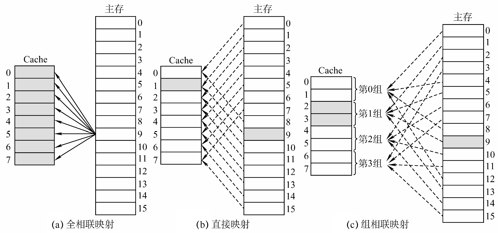

上图的Cache左边可能有的标记位：

- 地址标记位，表明其对应的块的地址，注意标记位数 = 主存块号的位数；有效位，表明其是否有效或为空；还可能有脏位。

分析：直接映射不需要地址标记位，但利用不充分、命中率低；全相联利用最好，但查找标记最慢。两种折中得到组相联。


### 2-3.2 替换算法与写策略

#### 1、替换算法

注意不管任何算法，现在被访问的主存块都一定会被立刻调入Cache！另外，不同的映射方式需要的算法也不完全一样。

- 全相联在完全满的时候才需要替换。
- 直接映射不需要替换。组相联映射在分组满了时需要替换。

第一种算法：随机算法RAND。若Cache已满，则随机选择一块替换。

>实现简单，完全不考虑局部性；命中率不稳定。但效果不见得差。

第二种算法：先进先出算法FIFO。若Cache已满，则替换最先被调入Cache的块。

>实现简单，未考虑局部性。
>
>会发生抖动现象：频繁的换入换出现象（刚被替换的块很快又被调入）

第三种算法：最不经常用算法LFU。

>实现：为每个Cache块设置“计数器”，用于记录每个Cache块被访问的次数。当Cache满后替换计数最少的。
>
>分析：曾经被经常访问的主存块在未来不一定会用到（如：微信视频聊天相关的块），并没有很好地遵循局部性原理，因此实际运行效果不如LRU。

第四种算法：近期最少使用算法LRU。

>实现：为每一个Cache块设置一个“计数器”，用于记录每个Cache块已经有多久没被访问了。当Cache满后替换“计数器”最大的。
>
>- 命中时，该行计数器清0，其他非空闲行全加1。
>- 未命中且有空行，则新装入的行计数器置0且其他非空行+1。
>- 未命中且无空行，则计数器最大的行被淘汰，装入新行。
>
>分析：该方法基于“局部性原理”，近期被访问过的主存块，在不久的将来也很有可能被再次访问，因此淘汰最久没被访问过的块是合理的。LRU算法的实际运行效果优秀，Cache命中率高。
>
>抖动现象：若频繁访问的主存块数量>Cache行总数则有可能发生，如：{1,2,3,4,5,1,2,3,4,5,1,2...}

#### 2、写策略

至此，我们已经知道了Cache与主存的映射方式、替换算法，现在还有一个尚未解决的问题：CPU修改了Cache中的数据副本，如何确保主存中数据母本的一致性？读不会引起不一致，需要写策略。

写命中情况下的第一类方法：写回法（或回写法），write-back。

>方法：当CPU对Cache写命中时，只修改Cache的内容，而不立即写入主存，只有当此块被换出时才写回主存。
>
>脏位：修改一个Cache行信息的时候将该行脏位置1；淘汰该行的时候，若脏位为1，则换出还要改主存。
>
>原理：如果一个块没有被换出，那么暂时的不一致并不会造成影响。
>
>分析：减少了访存次数，但存在数据不一致的隐患。

写命中情况下的第二类方法：全写法（或写直通），write-through。

>方法：当CPU对Cache写命中时，Cache和主存都要写。使用写缓冲，不需脏位。
>
>写缓冲：使用了缓冲后，CPU写主存的速度也很快；但如果替换过于频繁，则写缓冲跟不上CPU的速度而阻塞。
>
>分析：访存次数增加，速度变慢，但更能保证数据一致性。

写未命中情况下的第一类方法：写分配法，write-allocate与写回法，write-back。

>方法：使用脏位。
>
>- 写分配法：当CPU对Cache写不命中时，把主存中的块调入Cache，在Cache中修改。通常**搭配写回法**使用。
>- 写回法：当CPU对Cache写命中时，只修改Cache的内容而不立即写入主存，只有当此块被换出时才写回主存。
>
>在此种方法中，读写不命中都会调入Cache。

写未命中情况下的第二类方法：非写分配法，not-write-allocate与全写法，write-through。

>方法：使用写缓冲。
>
>- 非写分配法，当CPU对Cache写不命中时**只写入主存**，不调入Cache。搭配全写法使用。
>- 全写法，当CPU对Cache写命中时，必须把数据同时写入Cache主存，一般使用写缓冲。
>
>在此种方法中，只有读不命中才调入Cache。保证了一致性，但可能影响速度。

通常来说，各级Cache之间常采用“全写法+非写分配法”，而Cache-主存间使用“写回法+写分配法”。


### 2-3.3 虚拟存储器与段页存储方式

虚拟存储器由主存+外存构成，它在逻辑上有着外存+主存的容量，有着主存的速度。

#### 1、页式虚存

类似Cache和主存之间使用块联系，一个正在运行的程序一般也不会完整调入主存内，而是放在磁盘中，使用到才调入。程序和主存之间联系的方式即为段或页。一般程序页与主存块的大小相同。

对一个程序来说，在编程角度，我们总共需要若干主存可用空间，但实际运行时，只是在逻辑上占用了这么多主存，实际上逻辑地址和主存的物理地址有对应关系。因此CPU使用的也是逻辑地址，需要通过页表转换为物理地址（主存块号）。CPU查页表时，也需要先查页表基地址，才知道页表的位置，然后去查页表，找到物理地址后先查Cache再访存。


查询普通的页表的时间相当于访存一次。页表中的位：有效位表示已经被调入主存，访问位表访问次数（LFU算法）。


Cache、主存、CPU的数据交换主要是硬件自动完成，而主存和外存的交换主要是操作系统+硬件配合完成。

#### 2、快表TLB

将最近经常访问的页表项放入更高速的存储器中，就可以加快地址变换的速度，即TLB快表，是一个硬件。TLB是一种可以按内容寻找的“相联存储器”。

现在普通页表也可被称为慢表。TLB中存储的是页表项的副本，即对应的页号、主存块号，没有块中数据；Cache中存放的是主存块的副本，存放了数据。

使用了TLB和Cache结构的CPU访存过程：

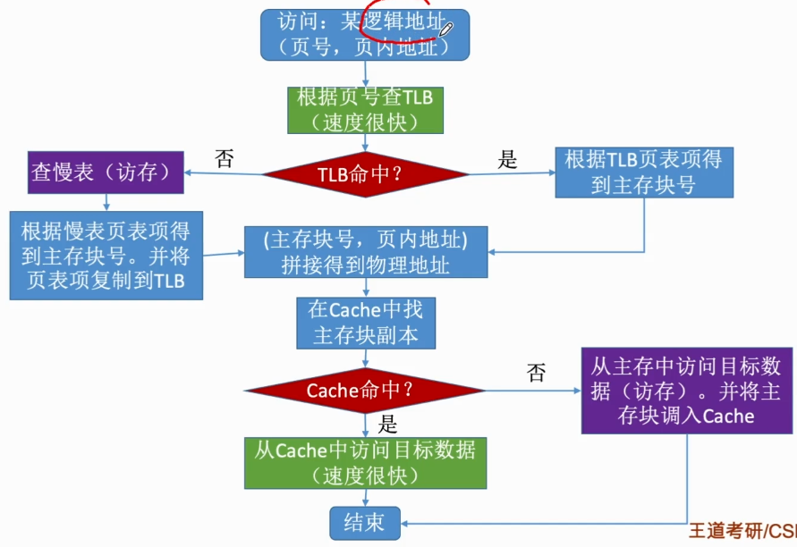

#### 3、段式虚存和段页式虚存

页式虚拟存储器——拆分成大小相等的页面。

段式虚拟存储器——按照功能模块拆分；如：#0段是自己的代码，#1段是库函数代码，#2段是变量。

段式存储使用段表，页式存储使用页表。段表结构如：


段页式：先分段再分页。


# 第三章 指令系统

## 3-1 指令系统和寻址

### 3-1.1 指令系统

#### 1、指令和操作码

控制器负责协调和控制各部分的工作过程，而控制器需要靠不同的指令来控制各元件。本章主要探讨操作码、指令的设计。

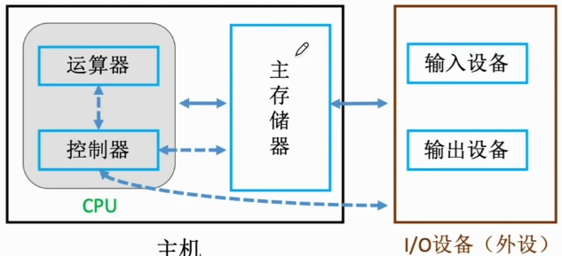

指令（又称机器指令）：是指示计算机执行某种操作的命令，是计算机运行的最小功能单位。

指令集：一台计算机的所有指令的集合构成该机的指令系统。注：一台计算机只能执行自己指令系统中的指令，不能执行其他系统的指令。


指令通常包括操作码OP和地址码A两个部分；一条指令可能包含若干地址码，根据地址码数不同，可以将指令分为零地址指令、一地址指令、二地址指令等。

1. 零地址指令有两类：
   - 第一类是不需要操作数，如空操作、停机、关中断等指令；
   - 第二类是在堆栈计算机中，两个操作数隐含存放在栈顶和次栈顶，计算结果压回栈顶，不需要在同一条指令中提供地址，如基于后缀表达式的计算。
2. 一地址指令：
   - 第一类只需要单操作数，如加1、减1、取反、求补等。指令含义：OP(A1)→A1，完成一条指令需要3次访存：取指→读A1→写A1。
   - 第二类需要两个操作数，但其中一个操作数隐含在某个寄存器（如隐含在ACC）中。指令含义：(ACC)OP(A1)→ACC。完成一条指令需要2次访存：取指→读A1。
3. 二地址指令：普通指令。指令含义：(A1)OP(A2)→A1；完成一条指令需要访存4次，取指→读A1→读A2→写A1。
4. 三地址指令：常用于需要两个操作数的算术运算、逻辑相关指令，A3一般用来存运算结果。
5. 四地址指令：指令含义：(A1)OP(A2)→A3，A4=下一条将要执行指令的地址。完成一条指令需要访存4次，取指→读A1→读A2→写A3。

按操作类型分类：

1. 数据传送：LOAD将存储器数据放到寄存器，STORE反过来。
2. 算术逻辑：算数运算和逻辑运算。
3. 移位操作：算数移位、逻辑移位、循环移位。
4. 转移操作：无条件转移JMP、条件转移（JZ，JO，JC）；调用CALL，返回RETURN；陷阱Trap等。
5. 输入输出操作：IO类，CPU和IO设备之间的数据传送。

下面是一些关于指令长度的定义与分类：

1. 指令字长：一条指令的总长度，一般是字节的整数倍。有半字长、单字长、双子长（两次访存）等。
2. 机器字长：CPU进行一次整数运算所能处理的二进制数据的位数（通常和ALU直接相关）。
3. 存储字长：一个存储单元中的二进制代码位数（通常和MDR位数相同）。
4. 两种指令结构：定长和变长。一般会用定长指令+变长操作码，即**扩展操作码指令格式**。

#### 2、扩展操作码

目的：主要是为了在不改变指令字长的情况下增加指令数量。

实例：指令字长为16位，每个地址码占4位；前4位为基本操作码字段OP，另有3个4位长的地址字段A1、A2和A3。

- 3地址：四位基本操作码有16种组合但是1111是扩展操作码，故15条。
- 2地址：第4-8位可以随意组合（除了1111），1111 1111之外共15条。
- 1地址：也是共15条。
- 0地址：共16条。1111 1111 1111 + xxxx。


以上设计中，不允许短码是常码前缀，所以1111一直都是保留的（类似哈夫曼编码），各指令操作码也不能重复。

设计举例：主要是要判定好什么指令是全1。**设地址长度为n，上一层（地址数多的）还剩下m种状态，则下一层有$m * 2^n$种状态。**

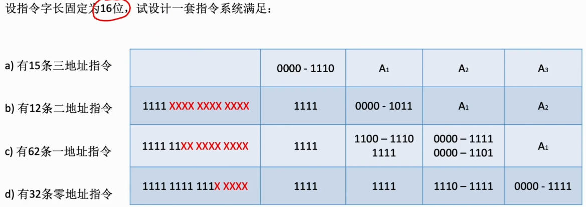

- 优：在指令字长有限的前提下仍保持比较丰富的指令种类；
- 缺：增加了指令译码和分析的难度，使控制器的设计复杂化。

#### 3、拓展：硬件实现数的大小比较

我们经常在寻址时需要比较两个数据的大小，这是由硬件完成的。硬件视角：

- 通过cmp指令比较a和b(如cmp a,b)，实质上是用a-b。
- 相减的结果，会记录在程序状态字寄存器PSW（也称为标志寄存器）中。

PSW中有CF、ZF、SF、OF等标志位，可判断各种信息。

同时，通过条件跳转（不是JMP无条件），可以实现if else的跳转，也有jg（更大时跳转）这样更加整合的指令。


### 3-1.2 指令的寻址方式

寻址分为指令寻址与数据寻址。

#### 1、指令寻址

指令寻址即：如何确定下一条指令的存放地址。

方式1：顺序寻址。描述为 (PC) + "1" -> PC。此处的1并不是真正的一个字，而是设定好的一个值。

>定长指令字结构：
>
>- 最简单的情况：指令字长 = 存储字长。
>- 第二种情况：指令字长 = k*存储字长，k为整数。让PC每次+2即可。
>
>变长指令字：要求操作码本身不能比一个能读入的字还要长！假设下图中同色的是同一条指令。
>
>
>
>- 首先读入第一个字，然后根据操作码确定本指令的长度。现在CPU读完整条指令后，会根据指令的字长n来修改PC，使得PC加n而不是1。

方式2：跳跃寻址。

>比如JMP指令：虽然取出JMP后PC还是默认+1，但该指令中的内容无条件将PC中的内容修改。
>
>另外：CALL、RETURN等。

#### 2、直接与间接寻址

数据寻址：确定本条指令的地址码指明的真实地址（有效地址，EA）。这是因为有不同的寻址方式。举例：指令中的地址可能只是逻辑地址，而不是真正的地址。


地址码的前边一般会加上寻址特征。根据不同的寻址方式位，有如下寻址方式：


下面基于一地址指令讲解前6种比较好理解的寻址方式。该过程中默认指令字长 = 机器字长 = 存储字长。


| 方式名     | 寻址方式                                             | 表达式   | 访存次数 | 备注                                                         |
| ---------- | ---------------------------------------------------- | -------- | -------- | ------------------------------------------------------------ |
| 直接       | A存EA                                                | EA = A   | 1+1 = 2  | 简单，但寻址范围不大且地址不宜修改                           |
| 间接       | A存EA地址                                            | EA = (A) | 1+2 = 3  | 可扩大寻址范围便于编程，但一次间址就要多2次访存              |
| 寄存器     | A存R的编号，数据在R中                                |          | 1        | 访问寄存器不需访存，快速；指令字短，支持向量运算。但寄存器数量有限。 |
| 寄存器间接 | R中存EA的地址，EA在主存中                            |          | 2        | 比一般的间址块，但还是要访问主存。                           |
| 隐含       | 没有显式给出A，而是在指令中隐含A的地址，如A存在ACC里 |          | 1        | 有利于缩短指令字长；但需要增加硬件。                         |
| 立即       | 操作数直接在指令中，A就是操作数，使用一个#来标识     |          | 1        | 不用访存，最快；但范围有限。                                 |

#### 3、偏移寻址

一共有三类，其区别在于偏移量不同。这三类访存都类似于间址，故次数都是2（取址1+执行1）。

- 相对寻址多用于转移指令。
- 基址寻址多用于多道程序，BR由OS管理。
- 变址寻址多用于循环求和等问题，IX由编程者管理。

第1种：基址寻址。EA = (BR) + A，BR为程序的起始地址。

>CPU内有一类重要的寄存器，即**基址寄存器**（Base address Register，BR）。其变种还有页表、段表的基址寄存器。OS中的**重定位寄存器**就是这一类。
>
>BR可以由专门的硬件来充当，也可以由某个通用寄存器来充当，后者在指令中将会指明具体寄存器（一般根据大小，不同寄存器大小不同）。运行前CPU会将BR修改为起始地址，存在PCB中。举例：某个程序起始位置是100，那么BR = 100。
>
>- 总结：基址寻址面向操作系统，可以由OS或管理程序管理，不可以由编程者指定。
>- 优点：有利于程序浮动、不需要考虑在哪里存储，方便并发、多道程序，扩大寻址范围。

第2种：变址寻址。EA = (IX) + A，程序员自己决定起点。

>IX（Index Register）为变址寄存器，同样可专用也可通用（要指明）。
>
>之前，如果要实现数组循环相加求和，则需要为每次循环单独构建一次指令。现在利用变址寻址可以不断改变IX的内容，方便循环。非常适合编制循环程序。
>
>
>
>
>
>- 总结：变址寻址面向用户，用户自己就可以指定IX的内容作为偏移量。
>- 优点：适合编制循环程序。

第2.5种：基址变址复合寻址。如EA = (BR) + (IX) + A。可认为类似复合函数，实际中很常用。

第3种：相对寻址。EA = (PC) + A，以PC所指地址为起点。

>把PC的内容加上指令格式中的形式地址A形成操作数的有效地址，即EA=(PC)+A，其中A是位移量，可正可负，补码表示。比如A是补码-1，PC内容是1002，那么该条指令应当指向1001。
>
>- 总结：该方法也可以保证循环的正常运行，非常适合用于循环for等（特别是while true这类长循环）。
>- 优点：操作数的地址不是固定的，而是随着PC值的变化而变化，并且与指令地址之间总是相差一个固定值，因此便于程序浮动（一段代码在程序内部的浮动）。相对寻址广泛应用于转移指令。

#### 4、堆栈寻址

堆栈寻址：操作数存放在堆栈中，隐含使用堆栈指针（SP）作为操作数地址。

堆栈是存储器（或专用寄存器组）中一块特定的按后进先出（LIFO）原则管理的存储区，该存储区中被读/写单元的地址是用一个特定的寄存器给出的，该寄存器称为堆栈指针（SP）。有两种实现方式：

- 使用专用寄存器，每个存放一个堆栈元素。称为硬堆栈，不访存。
- 在存储器（主存）中划出一片区域作为堆栈。即软堆栈，访存一次。

>寄存器法实现两个元素相加：记当前栈顶单元是Msp。注意出栈SP加一，入栈减一（程序由上到下的情况）。
>
>
>
>1. POP ACC，将栈顶元素放在ACC。
>2. (SP) +1 -> SP，即SP自增。
>3. POP X，栈顶元素放到X，然后SP再自增。
>4. ADD Y，即(ACC) + (X) -> Y，ALU工作将结果放到Y。
>5. PUSH Y，(SP) -1 -> SP，(Y) -> Msp。将Y推入栈顶。
>
>如果使用软堆栈，过程相同，弹栈入栈都需要访存，速度较慢，但通用性好。

应用：堆栈可用于函数调用时保存当前函数的相关信息（数据结构-递归）。

#### 5、总结


## 3-2 程序的机器代码表示

### 3-2.1 汇编指令初步

#### 1、高级语言与机器代码的对应

考试要求：要求能看懂部分X86汇编语言，将其翻译为C语言，结合C语言看懂其关键语句，如选择、循环、调用函数等；以X86为例分析机器语言指令格式与寻址方式。

机器级代码：汇编语言+二进制编码。汇编语言是二进制编码的助记符形式。

X86架构下的常用的8个寄存器以及4+8个拆分寄存器：E代表32bit，即Extended。

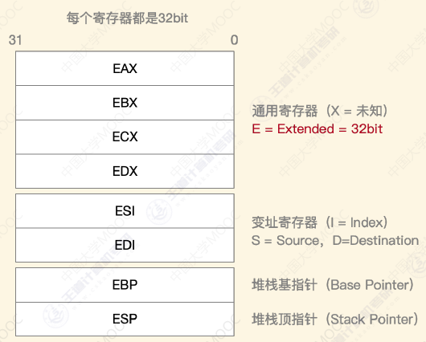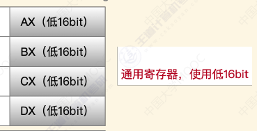

分析指令的作用：从下面的思维导图来指导。

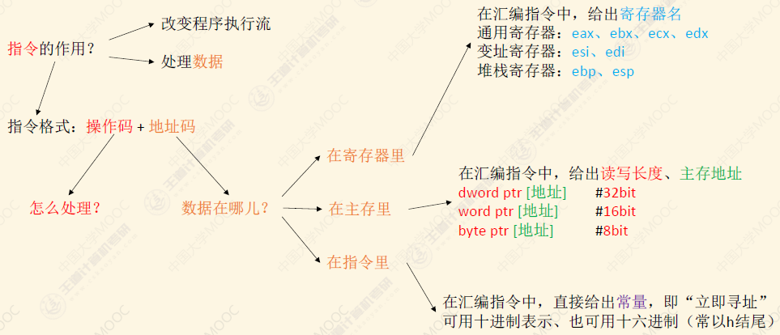

>mov d, s：将源操作数s移到目的操作数d。ds可以是立即数、寄存器和地址（地址要指明长度，未指明默认32bit）。dword ptr双字，32bit；word ptr单字，16bit；byte ptr字节，8bit。
>
>

#### 2、AT&T格式、Intel格式的汇编语言

由于题目中也可能出现这两种，故有必要能够看懂。现在考试常见Intel格式。

AT&T常用于Unix、Linux，Intel格式则常用于windows中。**两者最大不同：目的操作数和源操作数位置相反。**其余不同列出在下表中。


#### 3、CISC和RISC

这一节应当是本章最后介绍的内容，与CPU有较大关联。现已介绍了指令格式、指令和数据寻址方式，下面介绍两种具体的设计方向。

- 复杂指令集CISC：Complex Instruction Set Computer。设计思路：一条指令完成一个复杂的基本功能。如x86架构。常利用“存储指令”的思想，即设计好常用指令直接调用。功耗稍高，功能更齐全。
- 精简指令集RISC： Reduced Instruction Set Computer。设计思路：一条指令完成一个基本“动作”；多条指令组合完成一个复杂的基本功能。如ARM架构。遵循2-8原则，功能稍少，但功耗低、占用空间小，效率较高。

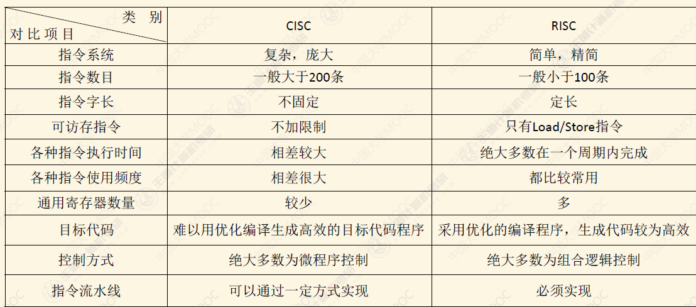

之前我们的add、mul等乘法指令可以直接访存，而RISC只能使用load和Store访存，所以我们介绍的体系一直都是CISC。

目前的知识点空白：微程序控制、组合逻辑控制；指令流水线。其他部分已经基本都介绍完。


### 3-2.2 X86汇编语言常见指令

#### 1、常用X86指令

常见算术运算指令：

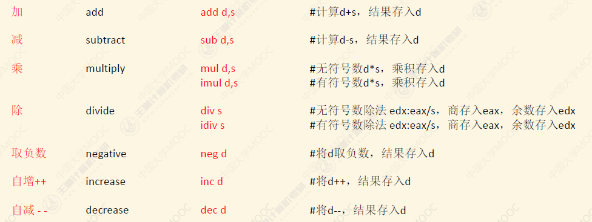

除法的`edx:eax`的意义：除法需要位扩展为64位，所以需要两个寄存器存储；相当于将被除数存在edx和eax内，最后edx放余数。

除使用ds外，也可以使用`<reg> <mem> <con>`来表示寄存器、主存和常量立即数。注意**X86中不允许两个操作数都来自主存**！

常见逻辑运算指令：

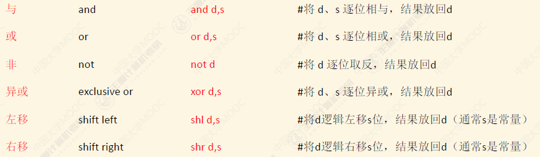

其他指令：将在后续结构部分重点介绍

- 用于实现分支结构、循环结构的指令：cmp、test、jmp、jxxx
- 用于实现函数调用的指令：push、pop、call、ret
- 用于实现数据转移的指令：mov

#### 2、选择语句

常识：IP寄存器（Instruction Pointer）就是程序计数器PC。平时PC默认取完一条指令后自增。

选择语句即分支语句，如if、switch等。一般使用cmp、test、jmp、jxxx来实现。

无条件转移指令 jmp：

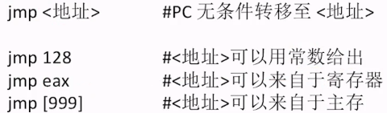

jmp除了可以跳转到给定的地址，还可以使用标号。标号后带冒号，名字可以自己取，类似flag、goto，不要滥用。尽管如此，jmp仍然无法实现if条件语句。于是，汇编借助cmp指令，给定了jxxx系列指令：


现在我们尝试将一个简单的if-else语句翻译为机器语句：

```x86
#C: if(a>b) c=a; else c=b;

mov eax,7		#假设变量a=7，存入eax
mov ebx,6		#假设变量b=6，存入ebx
cmp eax,ebx		#比较变量a和b
jg NEXT			#若a>b,转移到NEXT:
mov ecx,ebx		#假设用ecx存储变量c，令c=b
jmp END			#无条件转移到END：
NEXT:		
mov ecx,eax		#假设用ecx存储变量c，令c=a
END:
```

#### 3、循环语句

循环语句可以使用上一节的条件转移指令来实现：


需要注意的4个部分：初始化、能否直接跳过、主体、继续循环。


另外可以使用专用的指令：LOOP指令。其功能一定可以用条件转移代替。注意LOOP一定要用ECX寄存器来判断。


上图指令等价于：dec ecx；cmp ecx,0；jne Looptop。

补充：loopx指令——如loopnz、loopz。

- loopnz：当 ecx != 0 && ZF \== 0时，继续循环；
- loopz：当 ecx != 0 && ZF \== 1 时，继续循环。


### 3-2.3 函数调用的机器语言表示

#### 1、call、ret和leave

我们知道可以使用一片内存区域作为函数调用栈，FIFO，故main函数在最下面。每个函数的部分被称为**栈帧**。从最底层视角，我们知道函数运行完后就弹栈，然后接着运行原来的位置；从机器代码上，汇编语言通过Call指令跳转函数，通过leave ret指令返回原来的位置。

函数实际就是一段代码，所以使用标识符和ret来界定一个函数的起始和末尾。call和ret的实际作用时改变PC指向的地址。

- “过得去”：**call 将PC旧值压栈保存，然后设置PC新值，保证能跳转到被调用函数的第一条指令**。
- “回得来”：**ret 从函数的栈帧顶部找到IP旧值，将其出栈并写回IP，恢复IP旧值（IP即PC）**。

一般先leave再ret，leave的意思是关闭栈帧。除非是一个实例。

Call和ret的问题：不能带参和返回值。

#### 2、栈帧与指针

栈帧（Stack Frame）：保存函数大括号内定义的局部变量，以及函数调用相关的信息，与EBP（底）、ESP（顶）两个寄存器息息相关。

注意：教材与试卷常将栈底画在上，栈顶在下，因为前者是高地址后者是低地址。要注意区分。

现在假设在32位系统中，每个进程虚拟地址空间4GB，高地址的1GB是OS内核，剩下3GB是用户区。如图所示，现在主要探讨用户栈。

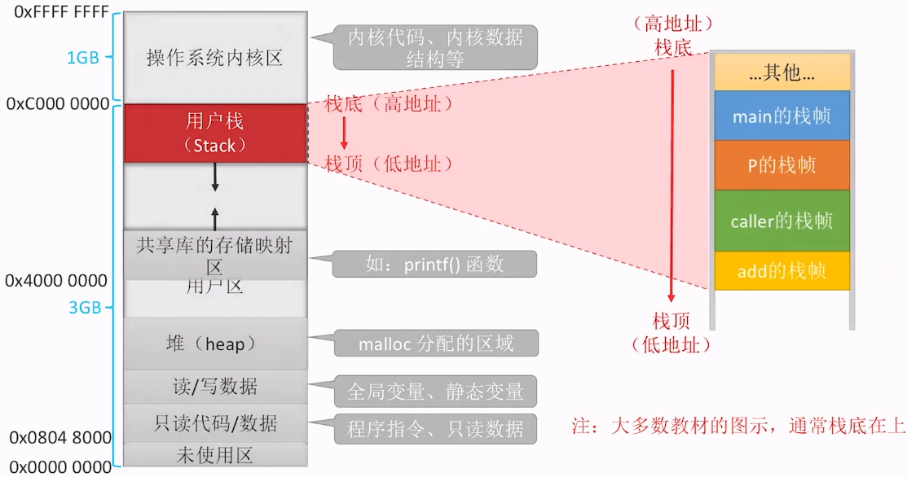

假设现在正在执行add函数，则ebp指向add的栈帧底部（高地址），esp指向add栈帧顶部。


现在，我们要利用ebp和esp两个寄存器指针来进行对栈帧数据的读写。对应x86指令是push与pop（都是操作esp）。32位系统一般以4字节为单位。

- push入栈：先让esp减4（往栈顶移动一个单位），再将数据压入当前位置。
- pop出栈：先让栈顶元素写入，再让esp加4。


利用pop和push，我们可以访问同一个栈帧的顶部元素了，但若要访问帧内其他位置还是比较麻烦。栈帧内每块的相对位置使用$esp+-n$来表示，就可以方便地使用`mov d,s`来将s的值复制到d内。

#### 3、切换栈帧

函数A调用了B；B执行时，ebp和esp应分别指向B栈帧的底部和顶部，但B执行完后，需要切换栈帧，重新指向A。这一过程是通过ret、leave和call指令实现的，下面详细解释：

call指令：进入新栈帧。

>
>
>相关指令：`push ebp`把ebp的旧值放到栈顶，然后`mov ebp,esp`将esp的值赋给ebp，即将之前栈帧的顶部（存放ebp的旧值的位置）变成现在的ebp的位置。由于这两条指令太过常用，也可以用`enter`指令来代替。之后就可以自由压栈添加数据了。
>
>

leave指令：离开当前栈帧。接上ret返回旧栈帧。

>要实现leave，应当：
>
>1. 首先将栈顶指针指到栈底，即`move esp,ebp`，将底复制到顶。
>2. 在call跳转时，我们在旧栈帧的顶上放上了旧值，所以现在esp、ebp所指位置的内容就是ebp的旧值。所以，现在让esp所指元素出栈，写入ebp，ebp的内容就变成了上一层的栈底。即`pop ebp`。

ret指令：在**leave指令执行结束后，现在esp指向的是PC旧值，现在需要把该值放回PC内**。故这一步应当是`pop pc`。

总结：执行顺序应当是call（A，保存旧值并设置PC新值以便跳转），enter（B，将两指针移动到合适位置），leave（B，移动指针），ret（弹出最上面的PC旧值）。除了main函数，其他所有函数的汇编代码结构都是enter-leave-ret。

#### 4、栈帧内容与参数、返回值

栈帧内部应当包含什么内容：

1. 栈帧底部，一定是上一层栈帧的基地址。
2. 栈帧顶部，一定是PC返回地址（IP旧值）。
3. 局部变量靠近栈帧底部，参数靠近栈顶。先定义的靠近栈顶（回扫）。一般来说ebp-4，ebp-8等都是函数的局部变量，ebp+4是上层的IP旧值，而ebp+8、ebp+12是上个函数的调用参数（也就是传入本函数的参数）。
4. gcc编译器规定，除了当前运行的函数大小随时会变化，其余每个栈帧大小是16B的整数倍，故会出现空闲区域。

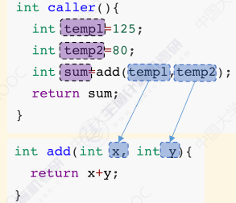

返回值：由于返回值只有一个，一般保存在eax中。

综上，一个栈帧内部区域的示意图应当是：


#### 5、调用与返回全过程总结


# 第四章 中央处理器

## 4-1 CPU基本结构、多处理器

### 4-1.1 CPU的功能

#### 1、运算器内的部件

- 核心ALU。
- 通用寄存器组，AX、BX、CX、DX等，存放操作数、中间结果。
- 堆栈指针SP。ESP是主存中的指针。
- 暂存寄存器，如累加寄存器ACC、乘商寄存器MQ。
- 程序状态字寄存器，包括OP、SF、ZF、CF等。
- 移位器、计数器（记录乘除次数等）。

ALU与每个寄存器都有专门的连线，称为“专用数据通路”方式。但如果部件数很多则不适用；而且，多个部件可能同时传输数据，会导致数据冲突。改进方法是：

1. 使用多路选择器MUX，选择一路输出。
2. 每一路使用一个三态门（小三角）。正常情况下不导电不连通，但可以输入控制信号来控制导通。

专用数据通路适用于对速度要求很高的部件，但成本过高。所以另一种解决方式是：使用CPU内部总线，寄存器等直接连接到CPU上。可能会存在较多冲突的情况，仍然需要解决：

- 设置暂存寄存器，若传来多个数据则先放到暂存寄存器，放在ALU的两个输入端、输出端。不能是通用寄存器。

#### 2、控制器的基本结构

1. 程序计数器PC，下一条指令在主存中的地址。
2. 指令寄存器IR，保存正执行的指令。
3. 指令译码器ID，对操作码字段译码并向CU提供特定信号。
4. 时序系统：由统一时钟CLOCK分频得到并产生各种时序信号。
5. 微操作信号发生器：根据IR、PSW、时序信号等，产生各种控制信号。有存储逻辑型和组合逻辑型两种结构。
6. 地址寄存器MAR，存放要访存的地址；数据寄存器MDR，存放暂时取出或要放入的信息。
7. 控制单元CU，重点讲述。

#### 3、CPU功能综述

CPU包括了运算器和控制器，而控制器中有指令寄存器IR、程序计数器PC、控制单元CU，CU主要提供“下一步该做什么”等逻辑。CPU必须要提供的功能有：

1. 指令控制。自动形成指令地址（PC自增），完成程序的顺序控制（取指、分析译码和执行）。执行指令即形成操作信号控制序列。每执行完一次，都要检查是否有中断信号。
2. 操作控制。一条指令的功能需要多个部件配合，CPU需产生相应操作信号并送达。
3. 时序控制。为按时间执行提供控制信号。
4. 数据加工，由运算器执行（ALU，X，ACC，MQ等组成）。
5. 中断处理。OS和CPU共同进行中断与恢复。它是实现程序各种执行顺序结构的基础，可以处理异常、管理总线与IO和特殊请求等。


橙色寄存器是用户可见的，包含运算器内的各寄存器和PC（JMP等可改变PC、PSW）。MAR、MDR、IR、暂存寄存器都不可见。

可以看到，CPU的四大组成部分分别是：中断系统、CU、ALU和寄存器。


### 4-1.2 多处理器基本概念

大纲新考点，只考选择题。

#### 1、计算机体系结构分类

基于指令流、数据流的数量，常见的计算机体系结构分为SISD、SIMD、MISD、MIMD四类，I代表指令流、D代表数据流，S是“单”，M是“多”。如MISD是“多指令流单数据流结构”。常规单处理器是SISD，常规多处理器是MIMD。

SISD：是本课程一直在学习的。

>特点：指令只能并发不能并行，**不支持数据级的并行**。一条指令处理一两条数据。
>
>
>
>硬件组成：一个处理器+一个主存。若为提升效率使用指令流水线，需设置多个功能部件，使用多模块交叉存储器。

SIMD：

>特点：虽然每个时刻只能执行一个指令序列，但可以并行处理多个数据。非常适合对大量类似的数据进行处理，如早期的某些显卡。该**并行是数据级并行**。
>
>
>
>硬件组成：一个CU，多个处理单元（如ALU），多个局部存储器，但只有一个主存。

MISD：多指令并行执行但却在处理同一个数据。不存在这种计算机！

MIMD：可以分为两类。一种是共享存储的多处理器系统，另一种是多计算机系统（如分布式）。

>共享存储的多处理器系统特点：
>
>- 各指令序列并行执行，处理多个不同的数据；是一种**线程级并行、甚至是超线程级并行**技术。
>- 各处理器之间可以通过Load、Store指令来访问同一个主存，以及互传数据。
>- 共享主存、最低一级的Cache。
>
>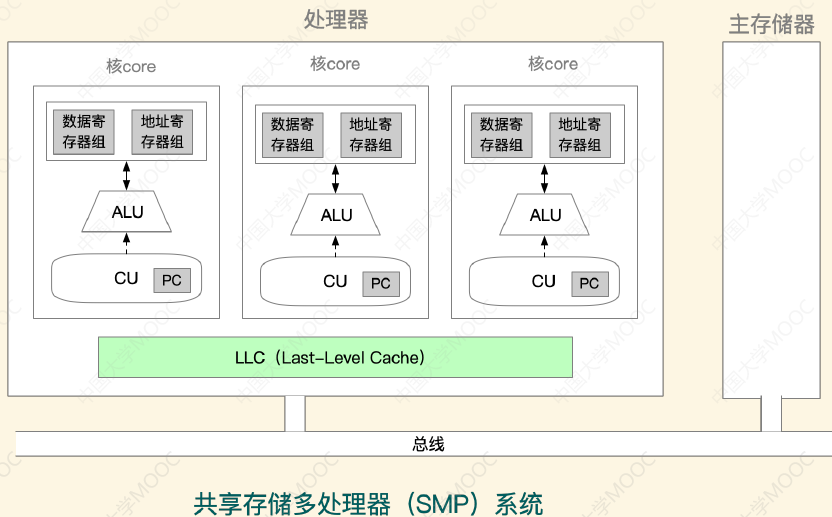     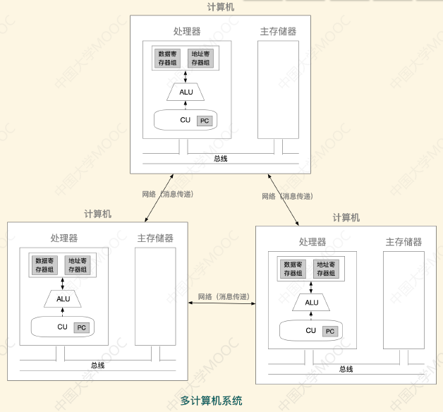
>
>多计算机系统的特性：
>
>- 多台计算机组成，各计算机存储独立，不能通过Load和Store来访问对方，通过网络等来互相传输数据。

#### 2、向量处理器

向量处理器是SIMD思想的进阶应用。特性：

- 一条指令的处理对象是“向量”；
- 擅长对向量型数据并行计算、浮点数运算，常被用于需要进行大量矩阵运算的科学计算机。

可以认为向量处理器的ALU是“向量ALU”。

向量处理器可以是SIMD、MIMD的任意一种，一般都是MIMD（性能要求高）。

硬件组成：

- 多个处理单元，多组“向量寄存器”。
- 主存应采用“多个端口同时读取”的交叉多模块存储器。
- 主存大小限定了机器的性能规模，因此要有大容量的、集中式的主存储器。

#### 3、共享内存多处理器（多核处理器）

共享内存多处理器（Shared Memory multi Processor，SMP）在MIMD的思想即有体现。

实际上，SMP就是通常意义上的多核处理器，只是命名角度不同。

- 前者着重于说明多个处理器共享一个主存、通过Load和Store可访问。
- 后者着重于说明一块芯片上集成了多个处理器（故又称片级多处理器），它们共享最低级的Cache和主存。

SMP和多计算机系统的区别很明显，有可能考选择题。


### 4-1.3 硬件多线程

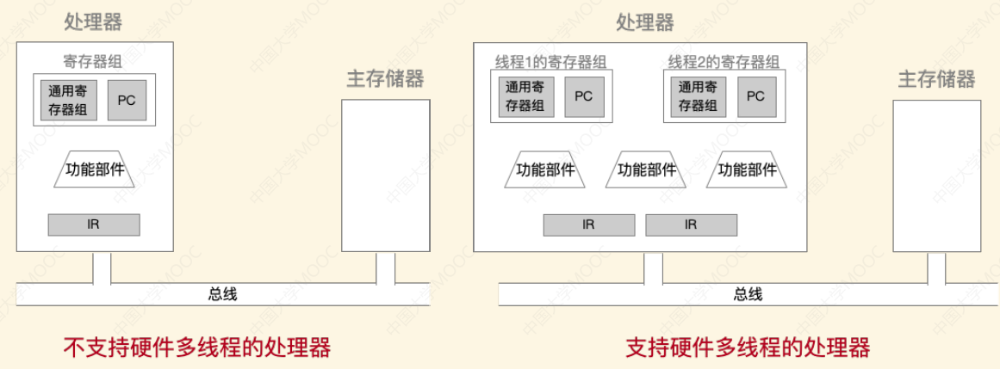

在不支持硬件多线程的处理器中（只有一个ALU等部件），同一时间只能处理一个线程的内容。如果要并发运行两个线程：

- 切换线程需要将PC指向更改，前一个进程中断。
- 为避免寄存器的值被覆盖，需要将它们保存下来（保存程序状态、运行现场，如放到PCB中）。
- 保存和恢复过程代价较大。

支持硬件多线程的处理器中（**不是多处理器！**），可以并行运行多个指令。一般有以下几种：

- 细粒度：每个时钟周期，即每个节拍切换一次线程。**指令级可能并行，但同一时刻也只有一个线程运行**！
- 粗粒度：连续多个节拍处理统一线程的指令序列；流水线阻塞时切换进程。**并行同上**！
- 同时多线程：每个节拍内同时处理多个线程的指令。**真正的指令级+线程级并行，但不一定速度最快**。

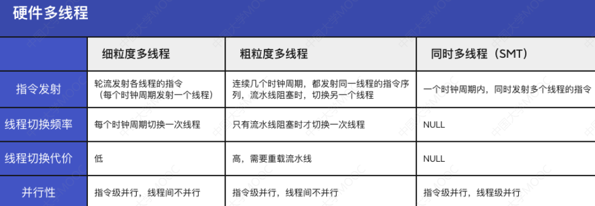

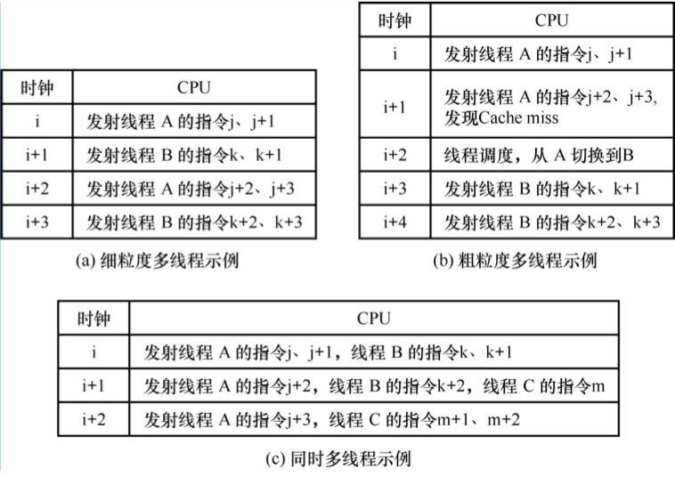


## 4-2 数据通路与控制器

### 4-2.1 数据通路

数据通路：数据在功能部件之间传送的路径。基本结构有三大类：CPU内部单总线方式；CPU内部多总线方式。

内部总线：指同一部件，如CPU内部连接各寄存器及运算部件之间的总线；

系统总线：指同一台计算机系统的各部件，如CPU、内存、通道和各类l/0接口间互相连接的总线。

每个存储部件（寄存器等）都有in和out信号，in信号导通则允许输入。

内部多总线方式逻辑和单总线相同。但单总线中，为了防止数据堵塞，必须要配合暂存器使用，不能随便输出。

#### 1、CPU内部单总线方式-常考

运算时，CPU内数据的流动只可能是3种：**寄存器之间；寄存器与主存之间；寄存器与ALU之间**。

内部单总线意味着：同一时刻只允许两个组件进行数据流动。

1. 寄存器之间数据传送：以PC内容存到MAR为例。(PC)→Bus→MAR，或写为：PC→Bus→MAR。
2. 主存与CPU间：以CPU取指为例：(PC)→Bus→MAR；1→R；M(MAR) → MDR；MDR→Bus→IR。
   - 即：将下一条指令地址（PC）放到MAR，然后CU发出读命令；然后MAR内存储的地址是指令的地址，在主存内取出该指令并放入MDR；最后通过总线放入IR。也可以添加(PC)+1→PC。
3. 执行算数或逻辑运算：以add指令为例。Ad(IR) → Bus → MAR；1→R；M(MAR) → MDR；MDR→Bus→Y；(ACC)+(Y)→Z；Z→ACC。
   - 即：将IR中蕴含的操作数地址放到MAR内，MARin、IRout；CU发布读命令；然后操作数放入Y，加好放入Z，最后Zout和ACCin有效，最后结果放入ACC。
   - 此处Y、ACC、Z都是ALU内部部件，有自己的专用通路。

下面是一个例题：分析`Add (R0), R1`的指令流程和控制信号。

>
>
>分析指令：将R1与R0指向的地址内的值相加，然后结果放在R0指向的地址内的值，即((R0) + R1 → (R0))。
>
>分析指令周期：包括取值，间址，执行三个机器周期。**照图上进行分析**。
>
>| 时序  | 微操作                          | 有效控制信号                       |
>| ----- | ------------------------------- | ---------------------------------- |
>| 取指1 | (PC)→MAR                        | PCout，MARin                       |
>| 取指2 | Mem(MAR) → MDR<br />(PC)+1 → PC | MemR，MARout，MDRinE               |
>| 取指3 | (MDR) → IR                      | MDRout， IRin                      |
>| 译码  | IR内指令译码、分析              |                                    |
>| 间址1 | (R0) → MAR                      | R0out，MARin                       |
>| 间址2 | Mem(MAR) → MDR                  | MemR，MARout，MDRinE               |
>| 间址3 | (MDR) → Y                       | MDRout，Yin                        |
>| 执行1 | (R1) + Y → Z                    | R1out，ALUin，CU向ALU发出的ADD信号 |
>| 执行2 | (Z) → MDR                       | Zout，MDRin                        |
>| 执行3 | (MDR) → (R0)                    | MemW，MDRoutE，MARout              |

#### 2、专用数据通路

考法：给出图，分析信号。图中的Cn代表一个控制信号；当该信号为1时，对应通路打开。

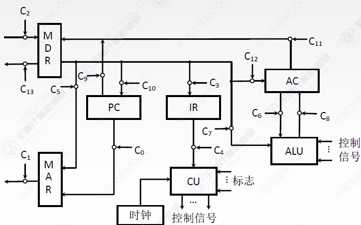

在取指周期：

1. Co有效。(PC)→MAR
2. (MAR)→主存。C1有效
3. 1→R，控制单元向主存发送读命令
4. M(MAR)→MDR。C2有效
5. (MDR)→IR。C3有效
6. (PC)+1→C。
7. Op(IR)→CU。C4有效

例题：

>下图是一个简化了的CPU与主存连接结构示意图（图中省略了所有的多路选择器）。其中有一个累加寄存器（ACC）、一个状态数据寄存器和其他4个寄存器：主存地址寄存器（MAR）、主存数据寄存器（MDR）、程序寄存器（PC）和指令寄存器（IR），各部件及其之间的连线表示数据通路，箭头表示信息传递方向。要求：
>（1）请写出图中a、b、c、d4个寄存器的名称。
>（2）简述图中取指令的数据通路。
>（3）简述数据在运算器和主存之间进行存/取访问的数据通路。
>（4）简述完成指令LDA X的数据通路（X为主存地址，LDA的功能为（X)→ACC）。
>（5）简述完成指令ADD Y的数据通路（Y为主存地址，ADD的功能为（ACC）+（Y）→ACC）。
>（6）简述完成指令STA Z的数据通路（Z为主存地址，STA的功能为（ACC）→Z）。
>
>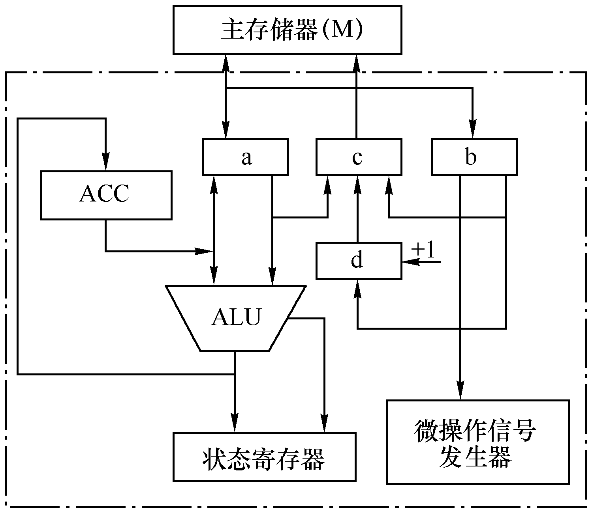
>
>第一问：
>
>- d有+1，是PC。PC的地址只输给MAR，故c是MAR。
>- a直接与ALU相连，与主存有出有入，只能是MDR。注意**和主存直接相连的只有MAR和MDR**。
>- b与pc相连，可以发信号给PC，且主存要发送给b，所以b是IR。或者：**只有IR与微操作信号发生器相连**。
>- 所有其他设备都要发信息给c，而c只发送给主存，只能是MAR。**有用结论：MAR三进单出，只出到PC**。
>
>第二问：(PC) → MAR；M(MAR) → MDR；(MDR) → IR；Op(IR) → 微操作信号发生器；(PC) + 1 → PC。
>
>第三问：
>
>- 运算器ACC没有存储数据的功能，要存在ACC里。设数据地址已放入MAR。
>- 取：M(MAR) → MDR；(MDR) → ALU → ACC；
>- 存：(ACC) → MDR；(MDR)→ M(MAR)。
>
>第4/5/6三个问是一个整体。本题实际上完成了计算加法并存放到Z寄存器的操作。
>
>- 第四问：X→ MAR；M(MAR) → MDR；(MDR) → ALU → ACC。
>- 第五问：Y → MAR；M(MAR)→ MDR；(MDR) → ALU, (ACC) → ALU；ALU进行加法运算；ALU → ACC
>- 第六问：Z→ MAR；(ACC) → MDR；(MDR)→ M(MAR)。


### 4-2.2 控制器设计1——硬布线控制器

#### 1、回顾

一个指令的四个机器周期及其英文全称：

- 取指FE：Fetch Cycles
- 间址IND：Indirect Cycles
- 执行EX：Execute Cycles
- 中断INT：Interrupt Cycles

如果多个微操作是相容的，那么它们可以在同一个时钟周期内完成。

定长机器周期法一般以访存所需节拍数为参考（最慢）。

根据指令操作码、目前的机器周期、节拍信号、机器状态条件，即可确定现在这个节拍下应该发出哪些“微命令”。这也是设计控制器CU的核心思想。

#### 2、硬布线控制器


- 指令操作码：指令寄存器IR通过译码器发送信号给CU，即可获取。
- 目前的机器周期：看FE、IND、EX、INT的值（集成在CU内部）。
- 节拍信号：时钟部件会输入脉冲信号，使得节拍发生器每个时钟周期都会发出一个节拍信号。
- 机器状态条件：这些标志位可能来自PSW、ACC的各标志位，或者来自于其他设备。

如何设计Cn的信号：举例如C1是(PC) → MAR，要在T0节拍完成，且位于FE周期。其逻辑表达式为`C1 = FE * T0`，则可设计如下：


据此，我们可以知道，要设计整个CU，必须将所有可能涉及到的逻辑表达式全部使用电路的形式画出。那么，如何得到与一个微操作相对应的电路：

1. 分析每个阶段的微操作序列（取指、间址、执行、中断四个阶段）。每个指令都要分析其涉及的微操作。
2. 选择CPU的控制方式：定长或不定长机器周期；若定长，节拍数。
3. 安排微操作时序：如限定了3个节拍，如何设计指令内部的微操作时序？
4. 电路设计，不考。

#### 3、设计电路

考题：对一个具体指令或周期，写出微操作命令+节拍安排。

第一步：分析每个阶段的微操作序列。由于取址、间址、中断三种机器周期基本是固定模板，变化基本都集中于执行周期。

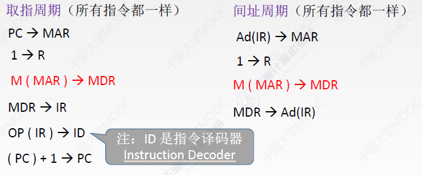

第二步：选择控制方式。此处以定长3拍为例。

第三步：安排微操作的时序。各个微操作之间的关系应该是类似于一个AOE网；每个操作有执行顺序、前继后继，且必须都完成。所以应当由以下原则：

- 原则一：微操作的先后顺序不得随意更改。
- 原则二：被控对象不同的微操作尽量安排在一个节拍内完成。
- 原则三：占用时间较短的微操作尽量安排在一个节拍内完成，并允许有先后顺序。
- 附加：如果只需要1个或2个节拍，那么


左图取指周期中，4,5两个操作只发生在CPU内部，时间都很短，所以将其安排到T2之中。与之对应的，3访存，必须对应一个节拍。右图是间址周期；**只有访存指令才可能有间址周期**。

最后一步：画出逻辑电路图。


### 4-2.3 控制器设计2——微程序控制器

#### 1、微程序控制器原理

硬布线控制器的微操作控制信号由组合逻辑电路根据当前的指令码、状态和时序，即时产生。时序信息包含机器周期、节拍。

相比于硬布线方式（纯物理硬件实现），微程序控制器利用软件思想，稍慢一些，但电路会更加通用。


程序由指令序列构成；每个机器周期中有多个微操作。我们可以将每个节拍内的一定微操作抽象为微指令，微指令序列构成微程序（对应一条指令）。在这种思想下，机器指令是对微指令功能的封装。

因此，可以出厂时将所有指令的微程序存入“**控制存储器**”中，就可以执行每条指令对应的微程序（包括微指令序列）即可。

区分：微操作=微命令；微指令包含若干个微操作。


微指令中，取指、间址、中断的微程序应当是类似的。但各具体指令的执行周期不同。

#### 2、结构

微程序实现控制器的核心思想是封装一系列微指令。于是我们可以将这些指令放在CU的一个存储器当中，需要的时候直接调用，一般是只读的ROM。此即**控制寄存器CM**，简称“控存”。

微指令分为两部分：操作控制字段，如控制发出什么信号；顺序控制字段，指明下一条（内部没有PC）。


接下来，类比CPU需要MAR、MDR才能访存，CU也需要一个套娃版的对应装置，这就是CMAR、CMDR，即微地址寄存器和微数据寄存器。CMDR位数 = 微指令字长，CMAR需要能表示CM内所有地址。

CU内部没有PC，需要一个“微地址形成部件”，保证微指令可以连续执行。它可以根据操作码找到对应的微指令的地址。

地址译码类似外部译码器；还有一个顺序逻辑元件负责控制执行顺序（跳转、中断等）。

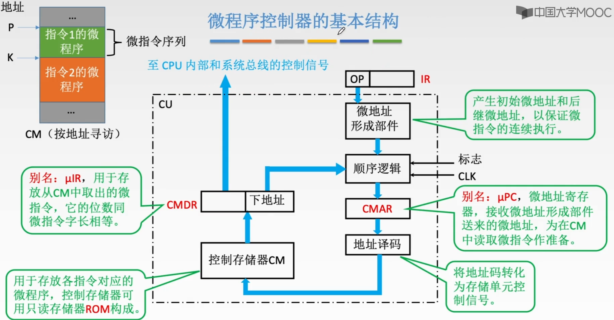

图中“下地址”指下一条微指令的地址，箭头标明一条指令从IR进到执行完成后CU发出信号的总过程。

微指令周期：从CM中取出一条微指令并执行相应微操作所需的时间。不大于一个节拍。

Tips：物理上，取指周期、执行周期看起来像是两个微程序，但逻辑上应该把它们看作一个整体。因此，**“一条指令对应一个微程序”的说法是正确的**。

#### 3、微程序控制器的设计

设计步骤与硬布线设计类似：

1. 分析每个阶段的微操作序列；
2. 写出对应指令的微操作与节奏安排；
3. 确定微指令格式；
4. 编写微指令码点。

第一步：分析每个阶段的微操作序列。以取指周期为例，节拍安排的不同之处如：

>
>
>另外，执行完一条微指令后，CMDR还应当将下地址信息传给CMAR，方便分析下一次指令地址，即Ad(CMDR) → CMAR。这需要单独消耗一个节拍。
>
>最后，还需要额外消耗一个节拍将下一个周期的微指令地址送入CMAR。当然，也可以将上图中最后两个微命令组合成如下图所示的一个微操作：
>
>
>
>综上，每个微指令都要多一个将地址放到CMAR的阶段，故**微程序控制器的节拍一般是硬布线节拍的2倍**。

第二步是先写出对应机器指令的的微操作命令、节拍安排。这一步与硬布线大致相同，都是写出每个周期需要的微操作。但还需要补充微程序控制器特有的微操作。

- 取指周期：Ad(CMDR)→ CMAR；OP（IR）→微地址形成部件→CMAR。
- 执行周期：Ad(CMDR) →CMAR。执行周期的最后一条微操作的下地址对应取指周期微程序的首地址。

第三步：确定微指令格式。包括控制码、地址码两部分。（下部分的直接编码，字段直接编码；下地址、操作码、增量计数等）。可能会考确定微指令字长。

第四步：根据操作控制字段每一位代表的微操作命令，编写每一条微指令的码点。即谁是001、谁是010等。


### 4-2.4 控制器设计3——微程序、微指令设计

#### 1、微程序设计分类

1. 静态微程序设计和动态微程序设计。
   - 静态：微程序无需改变，采用ROM。
   - 动态：通过改变微指令和微程序改变机器指令；有利于仿真，采用EPROM。
2. 毫微程序设计：即微程序的微程序。
   - 毫微程序用于解释微程序，即毫微程序对应微指令；微程序用于解释指令。
   - 毫微指令与微指令的关系类似微指令与机器指令的关系。实际就是二级套娃。

#### 2、微指令的三类格式

三类基本格式：重点探讨水平型的控制字段。

1. 水平型。一条微指令能定义多个可并行的微命令。
   - 优点：微程序短，执行速度快；
   - 缺点：微指令的长度较长，编写微程序较麻烦。
2. 垂直型微指令。一条微指令只能定义一个微命令，由微操作码字段规定具体功能。
   - 优点：微指令短、简单、规整，便于编写微程序；
   - 缺点：微程序长，执行速度慢，工作效率低。
3. 混合型微指令：在垂直型的基础上增加一些不太复杂的并行操作。微指令较短，仍便于编写；微程序也不长，执行速度加快。

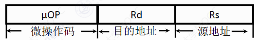

注意：**间址周期和中断周期的微程序在某些计算器内可以没有，不提就不用管；但取指周期和执行周期一定有**！

#### 3、微指令的编码方式

此处介绍水平型微指令的控制字段编码格式。

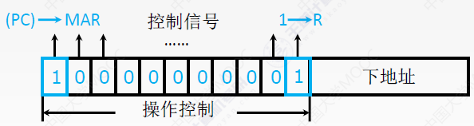

第一种：直接编码（直接控制）式。n和控制信号就需要n位，速度快但是占用空间太大。

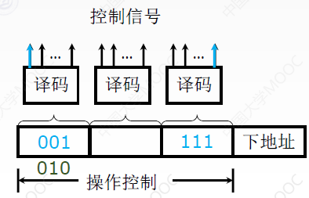

第二种·：字段直接编码式。将微指令的控制字段分成若干“段”，每段经译码后发出控制信号。微命令字段分段的原则是：

- 互斥性微命令放在同一段内；相容性微命令在不同段。每小段的长度不一定要相等。
- 每个小段不能包含太多信息位，否则将增加译码电路的复杂度。
- 每个段还要留出一个状态（通常000）表示本字段不发出微命令。如3位字段有7种互斥的微命令。


字段直接编码方法的优点是缩短微指令字长；但需要译码，所以稍慢一些。

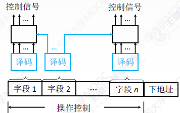

第三种：字段间接编码方式。一个字段的某些微命令需由另一个字段中的某些微命令来解释，不是靠字段直接译码发出的微命令，又称隐式编码。优点是可以进一步缩短微指令字长；缺点是使得速度更慢、并行能力更低。

#### 4、微指令的地址形成方式

第一种：微指令的下地址字段指出。下地址字段直接指出后继微指令的地址，又称断定方式。

第二种：根据机器指令的操作码形成。当机器指令取至指令寄存器后，微指令的地址由操作码经微地址形成部件形成。

第三种：增量计数器法 （CMAR）+1 → CMAR，模仿PC进行顺序执行。但一般CM内的微指令并不需要顺序执行。

第四种：分支转移方式。指明判别条件、转移地址；还需要指明转移成功后的去向。类似jmp指令：转移方式即判别条件。


第五种：测试网络（专用电路）。

第六种：硬件直接产生微程序入口地址。第一条微指令地址由专门硬件产生，中断周期也由硬件产生中断周期微程序首地址。

>例题：某计算机采用微程序控制器，共有32条指令，公共的取指令微程序包含2条微指令，各指令对应的微程序平均由4条微指令组成，采用断定法(下地址字段法）确定下条微指令地址，则微指令中下地址字段的位数至少是多少位？
>
>共有 32 * 4 + 2 = 130条微指令，故需要8位地址。


### 4-2.5 两种控制器设计法的比较

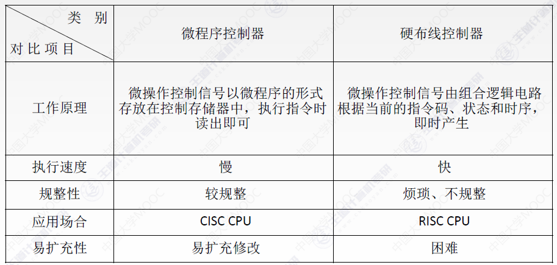

控制器部分的重点如红框所示：


## 4-3 指令的执行与指令流水线

### 4-3.1 指令执行过程

#### 1、指令周期

常说的指令周期 = 取指、分析（译码）、执行三个阶段；取完PC就+1，如果指令需要更改地址再说。还可能包括间址周期、中断周期。

工作周期：包括如下所示的四个周期。**四个工作周期都有CPU访存操作，只是访存的目的不同。**

- 取指周期：取指令；
- 间址周期：取有效地址；
- 执行周期：取操作数；
- 中断周期：保存程序断点。

CPU如何分析现在处于哪个阶段：利用4个可以存放1个bit的触发器，在某个阶段则触发器设置为1，其余设置为0。


计算机的三大周期：指令周期、机器周期和时钟周期。

- CPU从主存中每取出并执行一条指令所需的全部时间，是指令周期。它用n个机器周期来表示。
- 机器周期又叫CPU周期，包含若干时钟周期。
- 时钟周期也称为节拍、T周期或CPU时钟周期，是CPU操作的最基本单位，如3.0GHz。

CPU的机器周期可能定长，也可能不定长。但指令周期可以不等。

空指令NOP：在没有其他任务时，CPU便会取出空指令；由于空指令不包含执行和分析，所以其指令周期 = 取指周期（1个机器周期）。其他指令示例：

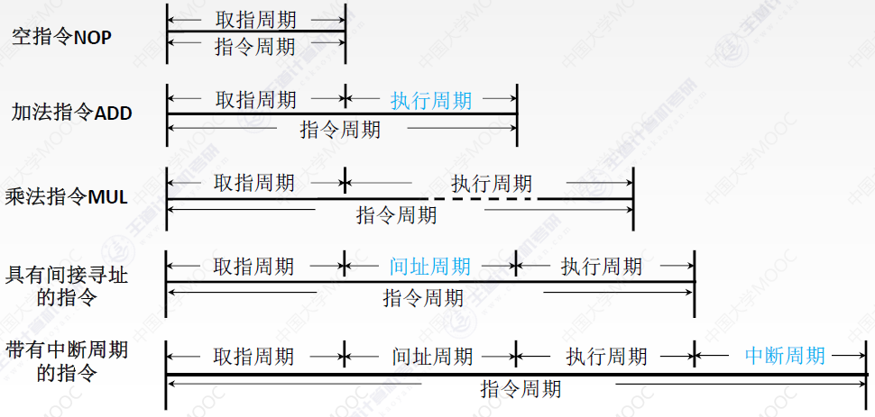

#### 2、指令周期的数据流

通过上一部分的讲解，就可以分析出四个工作周期的数据流向。取指周期：

>
>
>1. 当前指令地址送至存储器地址寄存器。（PC)→MAR
>2. CU发出控制信号（读），经控制总线传到主存。1→R（表示发出读信号，1→W表示写）。
>3. 将主存中，MAR所指的内容（即需要的指令）经数据总线送入MDR，记作M（MAR）→MDR。
>4. 将MDR中的内容送入IR译码，记作（MDR）→IR。IR进行翻译。
>5. 每次取指都必须有的：CU发出控制信号，形成下一条指令地址，记作(PC）+1→PC

间址周期：

>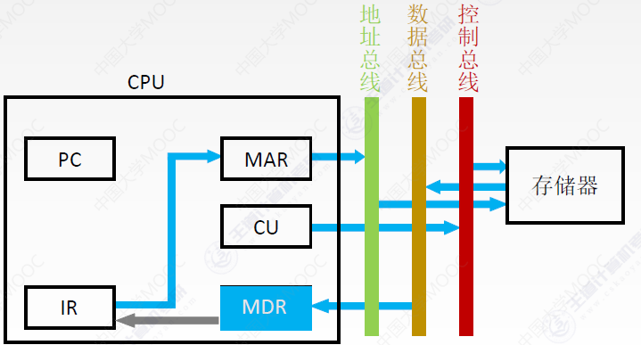
>
>1. 1.将指令的地址码送入MAR。Ad(IR)→MAR，或Ad(MDR)→MAR
>2. CU发出控制信号，启动主存做读操作。1→R。
>3. 将MAR所指主存中的内容经数据总线送入MDR。M（MAR)→MDR。
>4. 将有效地址送至指令的地址码字段。（MDR)→Ad（IR）（或者，直接将得到的地址拼接到IR，取代IR的形式地址）。

执行周期：无统一数据流向。将在后续章节统一讨论。

中断周期：实际上是一次写操作。

>
>
>中断：暂停当前任务去完成其他任务。为了能够恢复当前任务，需要保存断点。一般使用堆栈来保存断点，SP表示栈顶地址；设SP指向栈顶元素，进栈操作是先修改指针，后存入数据。
>
>1. CU控制将SP减1（往栈顶走），修改后的地址送入MAR。(SP)-1→SP,（SP）→MAR。本质上是将断点存入某个存储单元，假设其地址为a，故可记做：a→MAR。
>2. CU发出控制信号，启动主存做写操作。1→W。
>3. 将断点位置（PC内容）送入MDR。（PC)→ MDR
>4. CU控制将中断服务程序的入口地址（由向量地址形成部件产生）送入PC。向量地址→PC

#### 3、多指令执行方案

如果希望连续执行多条指令，那么有以下几种方案：

方案1：单指令周期。

- 所有指令都选用相同的执行时间来完成，指令之间串行执行；指令周期取决于执行时间最长的指令的执行时间。
- 设计简单，但降低整个系统的运行速度。

方案2：多指令周期。

- 不同类型的指令，选用不同的执行步骤来完成；指令之间串行执行。
- 可选用不同个数的时钟周期来完成不同指令的执行过程。效率更高，但需要复杂的硬件设计。

方案3：流水线方案。

- 思想：不同指令在不同阶段用到的硬件不同，可以按流水线方案来执行。


### 4-3.2 指令流水线的概念与多发

#### 1、定义

一条指令可以分为多个阶段，如取值、分析、执行。不同的机器周期用到的硬件也是不同的，如PC、IR只有取指用。故理论上存在流水线、让各个硬件等待时间大大减少的可能。

设取指、分析、执行3个阶段的时间都相等，用t表示，按以下几种执行方式分析n条指令的执行时间：


现在考虑进行重叠。可以进行多次重叠，重叠越多理论时间越少，但是控制程序也更复杂，实践中一般是分成5阶段、5次重叠。

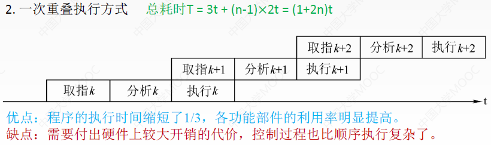


两种可以描述指令执行过程的图：上面的图称为指令执行过程图，纵坐标表示指令序列。下图是时空图，纵坐标表示阶段。

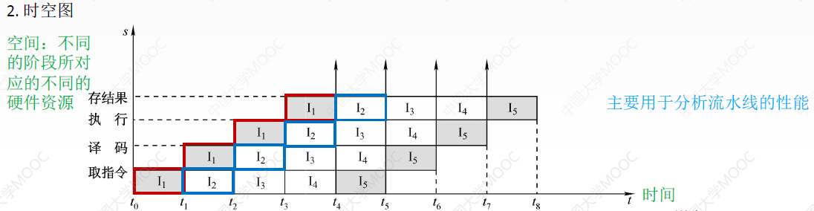

#### 2、性能指标

第一条：吞吐率（Throughput，TP）。指在单位时间内流水线所完成的任务数量，或是输出结果的数量。

>一条指令的执行分为k个阶段，每个阶段耗时$\Delta t$，一般取$\Delta t$ = 一个时钟周期。总计耗时$(k+n-1)*\Delta t$。
>
>- 在前$k*\Delta t$的时间内，还在进行装入；这一阶段每个节拍都没有任务完成。
>- 后$(n-1)*\Delta t$的时间内，每个节拍都有一个任务完成。
>
>
>
>两个概念：装入时间和排空时间。如上图，都等于$k*\Delta t$。

第二条：加速比（S）。完成同样一批任务，不使用流水线所用的时间与使用流水线所用的时间之比。

>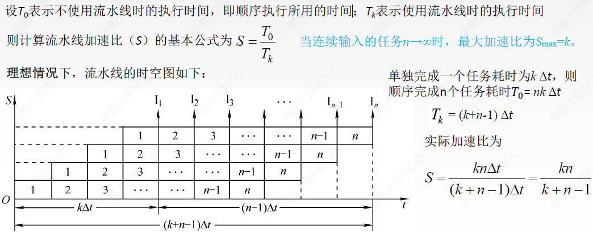

第三条：效率（E），或称设备利用率。

>这就体现了时空图的优势：面积之比就是效率！
>
>
>
>可以发现，把右侧阶梯拼到左侧，即减去$k^2$即可。

#### 3、多发技术

第一类：超标量技术。CU在一个时钟周期内发出多条独立的指令，是**指令级并行**。

- 原理：通过编译优化，将多个可并行的指令搭配起来。
- 需要多个功能部件，如IR、ALU等。
- 经编译器处理后，**指令顺序不能调整**。除非说明CPU支持乱序发射，则可以动态调整。
- 事实上是**空分复用技术**。


第二类：超流水技术。将每个时钟周期再分段（下图为3段）。

- 原理：在一个时钟周期内，一个功能部件使用多次。分n段后理论速度是原来的n倍。
- 实际上是**时分复用技术**。
- 同样，除了说明乱序发射，默认指令顺序也不能调整。

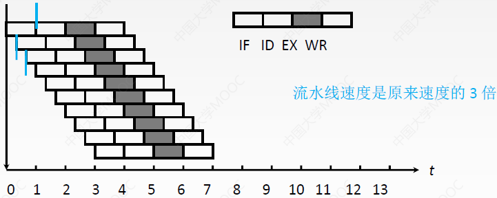

第三类：超长指令字。

- 原理：当编译程序挖掘出指令间的潜在并行性（EX阶段用到的功能部件相同），可将多条能并行操作的指令组合为一条多个操作码字段（甚至有几百位）的指令字。


### 4-3.3 指令流水线的影响因素与分类

#### 1、5段式流水线简介

此为一个经典的5段式流水线，是世界上第一个RISC模式的架构——MIPS所提出的，几乎必考。

- 流水线中每阶段耗时以最长耗时为准，故机器周期100ns。5阶段可不包含部分阶段，如访存等；但即使如此，也只是不执行而等待，仍然不能直接执行下一个阶段。这就保证了每条指令都需要500ns来执行。
- 蓝框内都是缓冲寄存器（或称锁存器），保存本段执行结果；如ID只需要80ns，为保证EX在200ns开始，需要寄存器暂存一段时间。

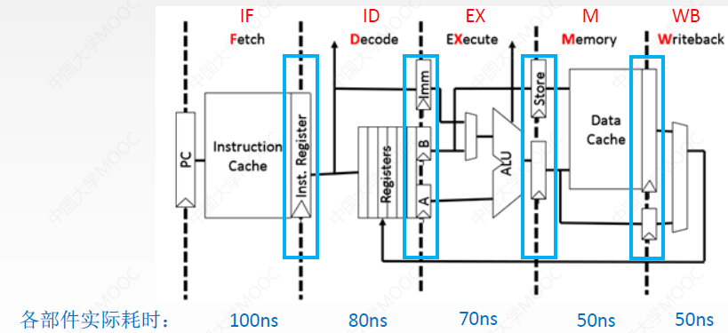

- IF：Instruction Fetch，取指。
- ID：Instruction Decode，**指令译码+取数阶段**。一般将数据放到寄存器是这个阶段。
- EX：Execute，执行。
- M：Memory，访存。
- WB：WriteBack，写回通用寄存器组。

图中Cache释疑：根据程序局部性原理，Cache命中率很高。

- 取址阶段的“Instruction Cache”：此处模拟了需要用到的指令已经放在了Cache中的情形。
- M阶段的“Data Cache”也相同，指内容都放在了Cache中。
- 为什么要分开：如果只有一个Cache模块，就无法做成流水线了。

图中IR后，ID阶段与EX阶段连接部分的三个缓冲：AB用来存操作数，Imm是立即数。

#### 2、影响因素

第一类冲突：结构相关，即资源冲突。类似OS中的互斥问题：某些资源不能共享。

>由于多条指令在同一时刻争用同一资源而形成的冲突。类似OS的进程互斥。
>
>左图中，内存、寄存器的使用有冲突。解决方式是：
>
>1. 下一个指令等待到可执行再装入流水线。
>2. 如上部分所说的，将FE、M两个阶段的访存分开放到ICache和DCache中，就可以保证同时进行了。寄存器也相同。
>
>

第二类冲突：数据相关，即数据冲突。数据的同步问题。

>指在一个程序中，存在必须**等前一条指令执行完才能执行后一条**的情况，则这两条指令数据相关。
>
>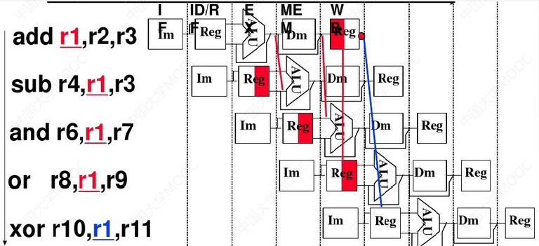    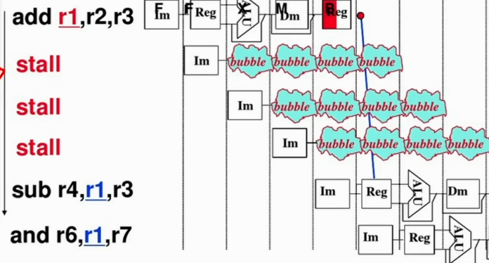
>
>如上图中，前4条指令必须顺序执行，不可以并行。
>
>解决方法有三类：
>
>1. 阻塞。原理是将相关指令暂停数个时钟周期。可分为硬件阻塞（stall，如右图，插入Bubble）和软件插入NOP（空指令）。
>2. 数据旁路技术，即转发机制。举例：sub r4,r1,r3中，r1的值正好是上面的add指令中r2+r3的值。如果能设计专用电路，将该值直接放到寄存器中，就不需要等了。
>3. 编译优化：编译器调整顺序。

第三类冲突：控制相关，即控制冲突。

>当流水线遇到转移指令和其他改变PC值的指令而造成断流时，会引起控制冲突。如JMP、CALL、函数返回、TRAP等。
>
>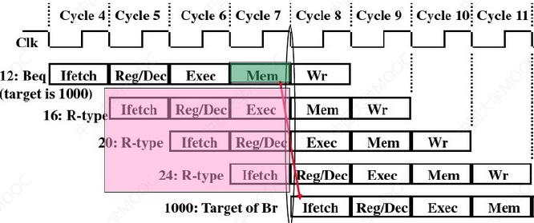
>
>重点探讨转移指令导致的控制冲突，其它都类似。如图，跳转到1000以后，16/20/24三条指令就无法继续执行完，造成了断流。
>
>1. 转移指令分支预测。有简单预测（true或false），动态预测（根据历史情况调整）。
>2. 预取转移成功和不成功两个控制流方向上的目标指令。不适用于switch等。
>3. 加快和提前形成条件码。可以利用优化等，或者模仿全加器的进位信息，提前把相关信息产生。
>4. 提高转移方向的猜准率。

三类冲突中，数据冲突最常考，对其进行补充如下（A是Against）：


#### 3、流水线的分类

简单了解即可，可按规模级别、功能、各段连接方式、反馈信号来分类。

根据流水线使用的级别的不同，分为部件功能级、处理机级和处理机间级流水线：

- 部件功能级流水：将复杂的算术逻辑运算组成流水线工作方式。例如，可将浮点加法操作分成求阶差、对阶、尾数相加以及结果规格化等4个子过程。是一种部件内部的流水线（如ALU等）。
- 处理机级流水：把一条指令解释过程分成多个子过程，如五段式中的IF取指、ID译码、EX执行、M访存及WB写回5个子过程。
- 处理机间流水：一种宏流水，其中每一个处理机完成某一专门任务，各个处理机所得到的结果需存放在与下一个处理机所共享的存储器中。

按流水线可以完成的功能，分为单功能流水线和多功能流水线：

- 单功能流水线：只能实现一种固定的专门功能的流水线；
- 多功能流水线：通过各段间的不同连接方式，可同时或不同时地实现多种功能的流水线。

按同一时间内各段之间的连接方式，分为静态流水线和动态流水线：

- 静态流水线指在同一时间内，流水线的各段只能按同一种功能的连接方式工作。
- 动态流水线指在同一时间内，当某些段正在实现某种运算时，另一些段却正在进行另一种运算。这样对提高流水线的效率很有好处，但会使流水线控制变得很复杂。


按流水线的各个功能段之间是否有反馈信号，分为线性流水线与非线性流水线：

- 线性流水线中，从输入到输出，每个功能段只允许经过一次，不存在反馈回路。
- 非线性流水线存在反馈回路，从输入到输出过程中，某些功能段将数次通过流水线，这种流水线适合进行线性递归的运算。

如此分类，我们的5段式指令流水线可以是：处理机级、单功能、静态的线性流水线。


### 4-3.4 五段式流水线详解

我们已经学习了5段式流水线，但现在还有一个问题——它真的能顺利执行所有指令吗？下面将使用考试中常见的5类指令来进行分别讲解。**RISC只有LOAD和STORE可以访存**！ICache、DCache分别存储指令和数据。

第一类：运算类。

>
>
>- IF：根据PC从指令Cache取指令至IF段的锁存器
>- ID：取出操作数至ID段锁存器。
>- EX：运算，将结果存入EX段锁存器。
>- M：不需访存，空段。五段流水线是RISC架构，运算的所有数据一定都来源于立即数和寄存器。
>- WB：将运算结果写回指定寄存器。

第二类：LOAD。

>
>
>- IF：根据PC从指令Cache取指，至IF段的锁存器。
>- ID：将基址寄存器的值放到锁存器A，将偏移量的值放到lmm
>- EX：运算，得到有效地址
>- M：从DataCache中取数并放入锁存器
>- WB：将取出的数写回寄存器

第三类：STORE。

>
>
>- IF：根据PC从ICache取指令至IF段的锁存器
>- ID：将基址寄存器的值放到锁存器A，将偏移量的值放到Imm。将要存的数放到B
>- EX：运算，得到有效地址。并将锁存器B的内容放到锁存器store。
>- M：写入DCache
>- WB：空段

第四类：条件转移。指令中的b是指branch，即分支。

>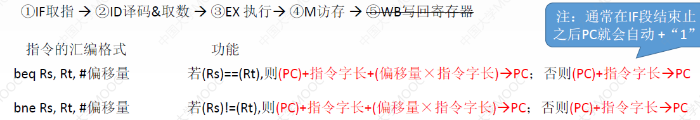
>
>- IF：根据PC从指令Cache取指令至IF段的锁存器
>- ID：进行比较的两个数放入锁存器A、B；偏移量放入lmm
>- EX：运算，比较两个数
>- M：将目标PC值写回PC
>- WB:空段
>
>条件转移阶段中，M只需要将PC值写回PC，WB什么都不用做。所以也有一种新的功能段是WrPC段，与其他5个段相互独立，可以代替M段。

第五类：无条件转移。就是jmp指令，通常相对寻址。

>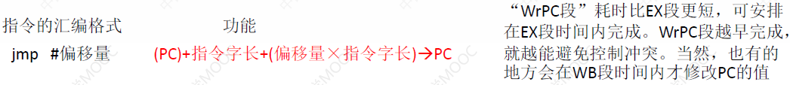
>
>- IF：根据PC从指令Cache取指令至IF段的锁存器
>- ID：偏移量放入lmm
>- EX：将目标PC值写回PC
>- M：空段
>- WB：空段
>
>同上，可以直接将最后三个部分安排为WrPC段。越早完成修改PC，越可以避免控制冲突。

阻塞说明：若上一条指令被阻塞在ID阶段（只完成IF，未执行ID），那么它的IF段数据就会被存在锁存器，导致下一条指令必须等待该段被空出才可以进行。如下图所示。


# 第五章 总线与IO

## 5-1 总线

### 5-1.1 总线概述与分类

#### 1、概述

总线是一组能为多个部件分时共享的公共信息传送线路。之前遇见过的总线大致分为三类：地址线、数据线、控制信号线。

若使用4根信号线组成一根总线，则所有硬件部件都可以通过这根总线传递数据，可并行发送4bit数据。同一时刻只能有一个部件发送数据，但是可有多个部件接受数据。如CPU发送0101，主存、SSD、外设等都可收到该信号。


为什么使用总线：早期计算机外部设备少时大多使用专用通路进行分散连接，不易实现随时增减外部设备。为了更好地解决I/O设备和主机之间连接的灵活性问题，计算机的结构从分散连接发展为总线连接。

总线的特性：重点关注传输方向、每根线的功能、时序关系。


#### 2、分类


按数据传输格式可以分为串行和并行总线。注意，**串行总线带宽可能比并行高**（频率高）。

1. 串行：
   - 优点：只需要一条传输线，成本低廉，广泛应用于长距离传输；应用于计算机内部时，可以节省布线空间。**不惧干扰，频率可以很高**！
   - 缺点：在数据发送和接收的时候要进行拆卸和装配，要考虑串行-并行转换的问题。
2. 并行：
   - 优点：总线的逻辑时序比较简单，电路实现起来比较容易。
   - 缺点：信号线数量多，占用更多的布线空间；远距离传输成本高昂；由于工作频率较高时，并行的**信号线之间会产生严重干扰**，对每条线等长的要求也越高，所以无法持续提升工作频率。


按总线功能可以分为片内总线、系统总线和通信总线。

1. 片内：芯片内部的总线，如CPU内部寄存器、ALU间的连线。
2. 系统总线：一般可以分为数据总线、地址总线和控制总线。
   - 数据总线：指令、操作数等；位数与机器字长、存储字长有关；双向，所有设备都需要。
   - 地址总线：主存、IO地址；位数与主存地址空间大小有关；一定是CPU单向指明想读写的地址。
   - 控制总线：一根控制线传输一个信号，从CPU发出的是控制命令，送入CPU的是其他部件的反馈信号。对单根，是单向的；但对整体是双向的。
3. 通信总线：用于计算机系统之间或计算机系统与其他系统(如远程通信设备、测试设备)之间信息传送的总线。也称外部总线。

注意，**数据通路不等于数据总线，如地址总线也是数据通路**。

按时序控制方式可分为同步和异步。后续展开。


### 5-1.2 系统总线的结构

系统总线的结构：单总线、双总线和三总线结构。

单总线：单总线并不是指只有**一根**信号线，而是**一组**总线。系统总线按传送信息的不同可以细分为地址总线、数据总线和控制总线。

- 结构：CPU、主存、I/O设备（通过I/O接口）都连接在一组总线上，允许I/O设备、CPU、主存间直接交换信息。
- 优点：结构简单，成本低，易于接入新的设备。
- 缺点：带宽低、负载重，多个部件只能**争用**唯一的总线，且不支持并行传送操作。更重要的是，**低速设备**（如键鼠）长时间占用总线，会导致效率极低。

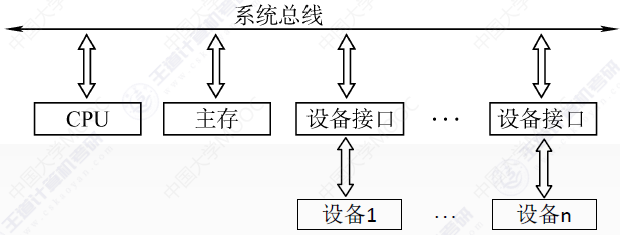

双总线：引入了一个“通道”设备（别被名字骗了，类似一个小CPU）。它可以负责管理IO设备、传输数据。

- 结构：双总线结构有两条总线，一条是主存总线，用于CPU、主存和通道之间进行数据传送；另一条是IO总线，用于多个外部设备与通道之间进行数据传送。
- 最大特点：支持突发（猝发）传送：送出一个地址，收到多个地址连续的数据。
- 优点：将较低速的I/0设备从单总线上分离出来，实现存储器总线和I/0总线分离。
- 缺点：需要增加通道等硬件设备。

一个特殊的概念：主存总线支持**猝发传输（突发）**。即送出一个地址后，收到多个地址连续的数据。这里可能因为IO设备的信息在通道中积压，然后被CPU一下完全读入。

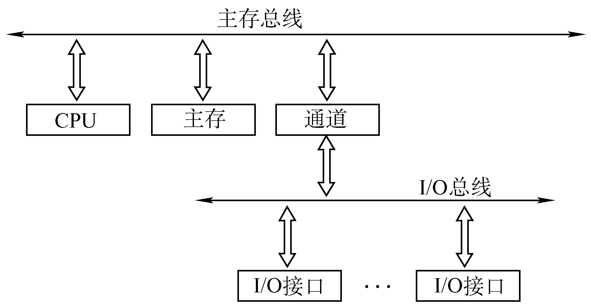

三总线：引入了DMA（Drirect Memory Access，直接内存访问）总线，专门和**高速外设交互**，而**低速外设使用IO总线**。缓解了IO设备访存和访问CPU慢且时间长的矛盾。IO总线最慢，DMA其次。

- 结构：三总线结构是在计算机系统各部件之间采用3条各自独立的总线来构成信息通路，这3条总线分别为主存总线、IO总线和直接内存访问DMA总线。
- 优点：提高了IO设备的性能，使其更快地响应命令，提高系统吞吐量。
- 缺点：系统工作效率较低。因为这三条总线**同一时刻CPU只能响应一条**。


拓展四总线结构：包括CPU总线、系统总线、高速总线和扩充总线。

- 引入桥接器：用于连接不同的总线，具有数据缓冲、转换和控制功能。如南桥北桥。
- 靠近CPU的总线速度较快。
- 每级总线的设计遵循总线标准（见本章第4节）。

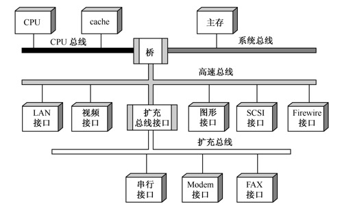


### 5-1.3 总线的八大性能指标

一：总线的传输周期（总线周期）：一次总线操作所需的时间

>包括申请阶段（进行仲裁）、寻址阶段、传输阶段和结束阶段（释放使用权），通常由若干个总线时钟周期构成。

二：总线时钟周期：即机器的时钟周期（节拍）

>一般而言，计算机有一个统一的时钟，以控制整个计算机的各个部件，总线也要受此时钟的控制。
>
>但注意，总线时钟周期和时钟周期的关系可能有时分复用、空分复用等，具体情况具体分析，只是默认一对一！
>
>现代计算机的总线时钟周期也有可能由桥决定。

三：总线的工作频率：总线上各种操作的频率，总线时钟周期的倒数。

>
>若总线周期=N个时钟周期，则总线的工作频率=时钟频率/N。实际上指一秒内传送几次数据。

四：总线的时钟频率：即机器的时钟频率，为时钟周期的倒数。

>
>若时钟周期为T，则时钟频率为1/T。实际上指一秒内有多少个时钟周期。

五：总线宽度：总线上同时能够传输的数据位数

>又称为总线位宽，通常是指数据总线的根数，如32根称为32位（bit）总线。

六：总线带宽：单位时间内总线上可传输数据的位数

>可理解为总线的数据传输率，通常用**每秒钟传送信息的字节数**来衡量，单位可用字节/秒（B/s）表示。
>
>
>
>关于猝发传输：默认给出一个首地址后就可以连续读写多个数据。

七：总线复用：一种时分复用技术。

>指一种信号线在不同的时间传输不同的信息。可以使用较少的线传输更多的信息，从而节省了空间和成本。
>
>如果图中出现“地址&数据总线”，则说明利用了总线复用技术。

八：信号线数：3种总线数的总和称为信号线数。

一个总线相关计算的例题：

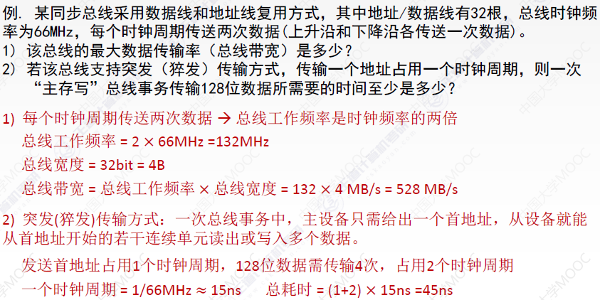


### 5-1.4 总线操作与定时

总线仲裁：解决多个设备争用总线问题。这两个内容大纲已删，了解即可。

- 获得了总线控制权的设备叫主设备；其他是从设备。
- 同一时刻，只能由一个设备控制传输操作，但其余设备都可以接受数据。“总线忙”信号的发出者就是主设备。
- 纯硬件仲裁：集中+分布。

总线标准：方便系统的模块化设计。

- 讨论串并行、位数、仲裁方式、定时方式、频率、周期、电气特性等。
- 考虑分类，要设计系统总线、局部总线还是设备总线、通信总线。
- 常见标准：ISA、EISA为系统总线；VESA、PCI、AGP、PCI-E为局部总线；RS-232C、SCSI、PCMCIA、USB、ATA、SATA为设备总线。

#### 1、总线传输的四个阶段

类似指令周期可以分为取指、间址、执行、中断，或者分成IF、ID、EX、M、WB五个周期，总线周期也有四个阶段：

1. 申请分配阶段：由需要使用总线的主模块（或主设备）提出申请，经总线仲裁机构决定将下一传输周期的总线使用权授予某一申请者。也可将此阶段细分为传输请求和总线仲裁两个阶段。
2. 寻址阶段：获得使用权的主模块通过总线发出本次要访问的从模块的地址及有关命令，启动参与本次传输的从模块。
3. 传输阶段：主模块和从模块进行数据交换，可单向或双向进行数据传送。
4. 结束阶段：主模块的有关信息均从系统总线上撤除，让出总线使用权。

在传输阶段，一定要主从设备配合才可，所以需要一种控制，即总线定时。总线定时是指总线在双方交换数据的过程中需要时间上配合关系的控制，它的实质是一种协议或规则。

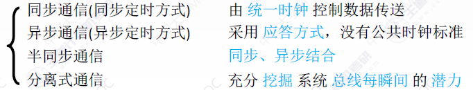

#### 2、四种总线定时

第一种：同步通信，即同步定时。

>总线控制器采用一个**固定、统一的**时钟信号来协调发送和接收双方的传送定时关系。
>
>
>
>假设：CPU作为主设备，对某个输入设备作为从设备进行读入。如图，总线传输周期有4个时钟周期。
>
>1. 取址：CPU在T1时刻的上升沿给出地址信息
>2. 传输1：在T2的上升沿给出读命令，与地址信息相符合的输入设备按命令进行一系列的内部操作，且必须在T3的上升沿来之前将CPU所需的数据送到数据总线上。
>3. 传输2：CPU在T3时钟周期内，将数据线上的信息传送到其内部寄存器中。
>4. 结束：CPU在T4的上升沿撤销读命令，输入设备不再向数据总线上传送数据，撤销它对数据总线的驱动。
>
>分析：
>
>- 优点：传送速度快，具有较高的传输速率；总线控制逻辑简单。
>- 缺点：主从设备属于强制性同步，如果从设备在T3周期没办法给出数据，那么就会超出时钟周期；时间不足，不能及时进行数据通信的有效性检验，可靠性较差。
>- 同步通信适用于总线长度较短，及部件的存取时间接近时。

第二种：异步通信，即异步定时。

>- 没有统一的时钟，也没有固定的时间间隔，完全依靠传送双方相互制约的**“握手”信号**来实现定时控制。
>- 主设备提出交换信息的“请求”信号，经接口传送到从设备；从设备接到主设备的请求后，通过接口向主设备发出“回答”信号。
>
>根据“请求”和“回答”信号的撤销是否互锁，分为不互锁、半互锁、全互锁方式。
>>这部分在计网中应当有学习。其实就是**三次握手**。
>>
>>
>>
>>
>>
>>
>
>分析：
>
>- 优点：总线周期长度可变，能保证两个工作速度相差很大的部件或设备之间可靠地进行信息交换，自动适应时间的配合。
>- 缺点：比同步通信复杂，速度比同步定时方式慢。

第三种：半同步通信，是同步异步的结合。

>- 同步：发送方用系统时钟前沿发信号；接收方用系统时钟后沿判断、识别。
>- 异步：允许不同速度的模块和谐工作。
>
>将这两者结合，就得到了半同步通信。**统一时钟的基础上，增加一个“等待”响应信号**WAIT。WAIT是一种反馈信号。
>
>

第四种：分离式通信。

>上面三种通信方式的特点都是：有一个准备数据的时间，该时间总线是空闲的。
>
>
>
>于是，现在将一个总线传输周期分为两个子周期，即上面的1/3部分，准备数据的时间放弃总线。
>
>1. 子周期1：**主模块**申请占用总线，使用完后放弃总线的使用权。
>2. 子周期2：**从模块**申请占用总线，将各种信息送至总线上。


## 5-2 IO与中断

### 5-2.1 IO系统及其控制

#### 1、IO系统组成

IO系统一般由软件和硬件两方面组成。

- 硬件包括IO接口和IO设备。
- 软件包括驱动程序、用户程序、管理程序等。

主机与IO设备的信息交换可以采用IO指令和通道指令来实现。IO指令与CPU通常的指令略有不同。


#### 2、IO控制方式

CPU要控制键盘IO的完成，有两种方式：

1. 程序查询方式。CPU不断轮询检查IO控制器中的“状态寄存器”，检测到状态为“已完成”之后，再从数据寄存器取出输入数据。
2. 程序中断方式。等待键盘IO时CPU可以先去执行其他程序，键盘IO完成后IO控制器向CPU发出中断请求，CPU响应中断请求，并取走输入数据。

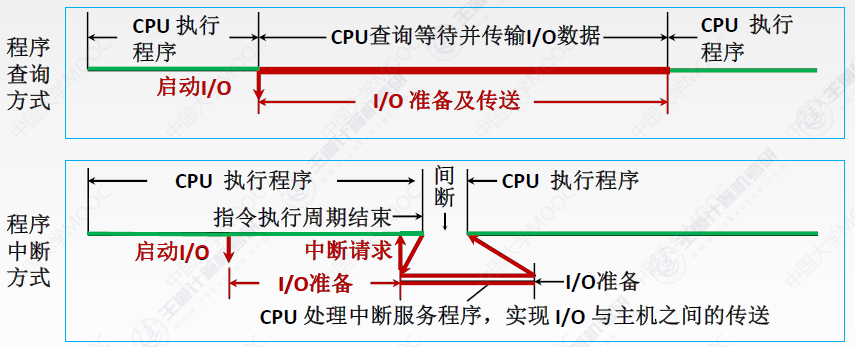

第一种方式等待时间很长，成本比较高；第二种方式看似有道理，但实际上由于**中断代价**较大，只适用于部分设备。比如磁盘每读入一个字就中断一次，键盘每输入一个字符就中断一次，都是不可接受的。

在三总线系统结构中，我们引入过DMA总线，于是有DMA控制方式：

- DMA控制方式：主存与高速I/O设备之间有一条直接数据通路（DMA总线）。CPU向DMA接口发出RW命令，并指明主存地址、磁盘地址、读写数据量等参数。
- DMA控制器自动控制磁盘与主存的数据读写，每完成一块数据读写（如1KB为一块），才向CPU发出一次中断请求。


第四种控制方式：通道控制。有些大型机上可能有几千个外设，不能把宝贵的CPU资源浪费在这些低速的设备上，于是有了通道。通道可以识别并执行一系列通道指令，通道指令种类、功能通常比较单一。

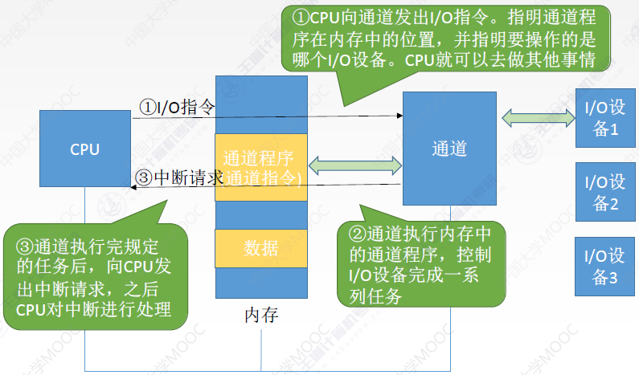

#### 3、外设

重要考点：VRAM的计算、磁盘的存取时间。磁盘相关计算见OS中。

使用阴极射线管显示器（CRT）字符显示：字符使用点阵存储。

显示存储器也称刷新存储器。n位灰度级有$2^n$种颜色或亮度。

- VRAM容量：分辨率 * 灰度级位数。
- VRAM带宽：分辨率 * 灰度级位数 * 频率。

VRAM容量的理论最小值就是一帧的大小。举例：256色、144Hz的3000 * 2000屏幕，VRAM容量必须大于6MB，带宽必须大于864MB/s。


### 5-2.2 IO接口

#### 1、简介

常见IO设备可统称外设，一般有存储设备、输入设备、输出设备。主机一般通过**IO接口**（又称IO控制器、设备控制器，与通道一样可看成小CPU，通常集成于主板）与IO设备交互。


CPU比外设快得多，所以IO接口中有一些缓冲寄存器，基本对应总线。


**控制、状态寄存器在使用时间上是错开的，因此可将二者合二为一，也可以分开**。

IO接口的作用：

- 数据缓冲：通过数据缓冲寄存器(DBR)达到主机和外设工作速度的匹配。
- 错误或状态监测：通过状态寄存器反馈设备的各种错误、状态信息，供CPU查用。
- 控制和定时：接收从控制总线发来的控制信号、时钟信号。
- 数据格式转换：串-并、并-串等格式转换。
- **最终目的是与主机和设备通信：实现主机——IO接口——IO设备之间的通信**。

IO接口的分类：

1. 按数据传送方式可分为：
   - 并行接口：一个字节或一个字所有位同时传送。
   - 串行接口：一位一位地传送。
   - 注：“数据传送方式”指外设和接口一侧的传送；而在主机和接口一侧，数据总是并行传送的。接口要完成串并行转换。
2. 按主机访问I/0设备的控制方式可分为：程序查询接口、中断接口、DMA接口。
3. 按功能选择的灵活性可分为：可编程接口、不可编程接口。

#### 2、IO接口结构与工作原理

IO接口有内部和外部两个接口；部分IO接口可以连接多个设备。

- 内部接口（主机侧）：内部接口与系统总线相连，实质上是与内存、CPU相连。2000年前数据的传输方式只能是并行传输，之后则串行传输也开始流行。
- 外部接口（设备侧）：外部接口通过接口电缆与外设相连，外部接口的数据传输可能是串行方式，因此1/0接口需具有串/并转换功能。

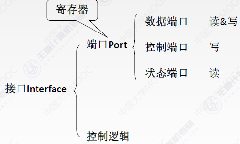

工作原理：

1. 确定要操作的设备：每个设备对应一组寄存器，操作不同的寄存器（地址不同）就是在操作不同的设备。
2. CPU发出命令字到控制寄存器，在驱动程序的协助下命令被传给外设。
3. 读状态：CPU在状态寄存器读取状态字，获取设备、IO控制器的状态信息。
4. 读写数据：在数据缓冲寄存器读写，因此IO接口的各种寄存器也被称为IO端口。

关于IO端口的第二定义：借口电路中可以直接被CPU访问的寄存器，它们每个端口都有自己的地址。这就涉及到编址。

#### 3、IO端口的编址

一般来说有两种编址思想：统一编址和独立编址。后者提供了专用指令，常适用于外设众多、插拔频繁的情况，如Intel处理器利用IN、OUT指令；前者没有专用指令，一般是简单的外设，如RISC。


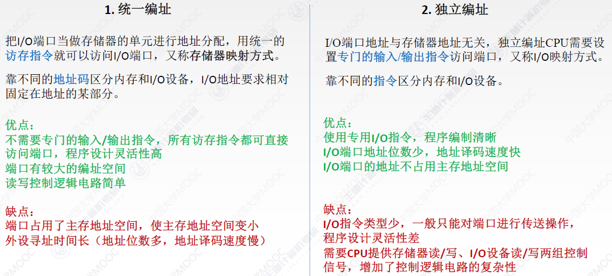


### 5-2.3 IO方式

对上面讲过的程序查询方式、程序中断方式和DMA方式进行补充拓展。

#### 1、程序查询方式

该种方式中，**CPU与IO串行工作，效率很低**。实际上有两种查询方式：

- 独占查询：CPU所有的时间都在查询I/O状态，完全串行；
- 定时查询：在保证数据不丢失的情况下，每隔一段时间CPU就查询一次I/O状态。间隔内CPU可以执行其他程序。该方式可以接受。


X86中的IO指令：

- IN Rd,Rs：把IO端口Rs的数据输入到CPU寄存器Rd。
- OUT Rd,Rs：把CPU寄存器Rs的数据输出到IO端口Rd。

详细流程图：中间的循环是一个“轮询”。


一道例题：


#### 2、程序中断方式

对中断系统的介绍，见最后一部分。程序中断方式的流程见下图：

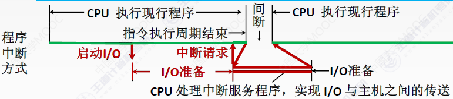

详细执行过程：


一道例题：

>假定CPU主频为50MHz，CPI为4。设备D采用异步串行通信方式向主机传送7位ASCII字符，通信规程中有1位奇校验位和1位停止位，从D接收启动命令到字符送入I/0端口需要0.5ms。请回答下列问题，要求说明理由。
>
>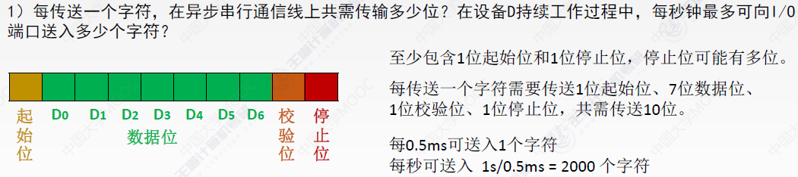
>
>

#### 3、DMA方式

DMA传输的单位一般和主存存取的单位相同，即一个块。DMA一般**使用系统总线进行批量的数据传输**。


CPU与DMA控制器的工作流程：

1. 传送前：
   - 接受外设发出的DMA请求（外设传送一个字的请求），并向CPU发出总线请求。
   - CPU响应此总线请求，发出总线响应信号，接管总线控制权，进入DMA操作周期。
2. 传送时：
   - 确定传送数据的主存单元地址及长度，并能自动修改主存地址计数和传送长度计数。
   - 规定数据在主存和外设间的传送方向，发出读写等控制信号，执行数据传送操作。
3. 传送后：向CPU报告DMA操作的结束。

DMA控制器：简称DMAC。


具体工作流程：注意区分**DMA请求（准备向主存传输1块数据，不需要CPU参与）和DMA中断请求（已经完成）**。

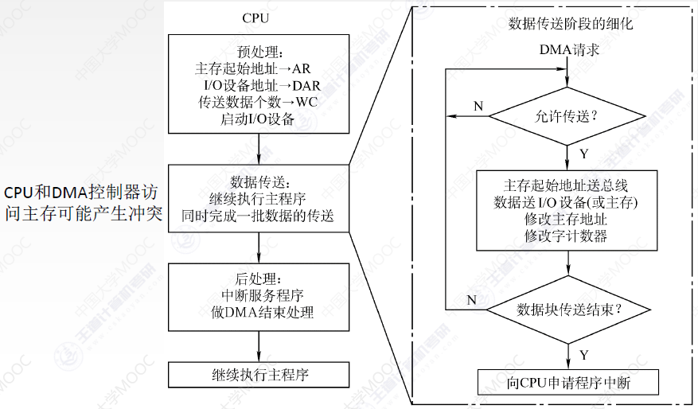

**主存和DMA控制器之间有一条数据通路**，因此主存和IO设备之间交换信息时，不通过CPU。但当IO设备和CPU同时访问主存时，可能发生冲突，为了有效地使用主存，DMA控制器与CPU通常采用以下3种方法使用主存：

1. 停止CPU访问主存。DMA传输一整块的数据的时候，不允许cpu访存。简单，效率低。
2. DMA与CPU交替访存，时分复用技术。硬件逻辑复杂。
3. 周期挪用技术（存取周期）。DMA访问主存有三种可能：
   - CPU此时不访存（不冲突）
   - CPU正在访存（等待CPU的存取周期结束，再让出总线）
   - CPU与DMA同时请求访存：I/O访存优先。

DMA方式的特点总结：

- 主存和DMA接口之间有一条直接数据通路。
- DMA方式传送数据不需经过CPU，因此不必中断现行程序，可以实现**IO与主机并行工作，程序和传送并行工作**。

#### 4、中断方式和DMA方式的对比

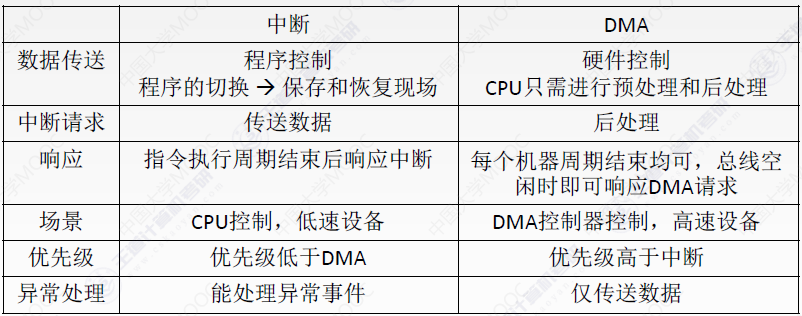


### 5-2.4 中断系统

#### 1、中断及其分类


程序中断：在计算机执行现行程序的过程中，出现某些急需处理的异常情况或特殊请求，CPU暂时中止现程序，转去对这些异常情况或特殊请求进行处理；处理完毕后CPU又自动返回到现行程序的断点处，继续执行原程序。

处理中断的程序叫“中断服务程序”，不同中断通常有不同的服务程序。

中断工作流程：若不是关中断状态（**PSW中存放是否关中断；关中断指令用于实现某些原子操作**），则执行：

1. 中断请求：中断源向CPU发送中断请求信号。
2. 中断响应：响应中断的条件。此事还需要进行中断判优：多个中断源同时提出请求，通过中断判优逻辑响应其中一个。
3. 中断处理：中断隐指令将CPU处理位置转移到正确的服务程序；然后中断服务程序被执行。

中断的分类：一般外设的中断都是可屏蔽的，除了强制关机等不可屏蔽。一般硬件中断优先级最高。

1. 硬件故障中断属于最高级，其次是软件中断；
2. 非屏蔽中断优于可屏蔽中断；
3. DMA请求优于I/O设备传送的中断请求；
4. 高速设备优于低速设备；
5. 输入设备优于输出设备；
6. 实时设备优于普通设备。

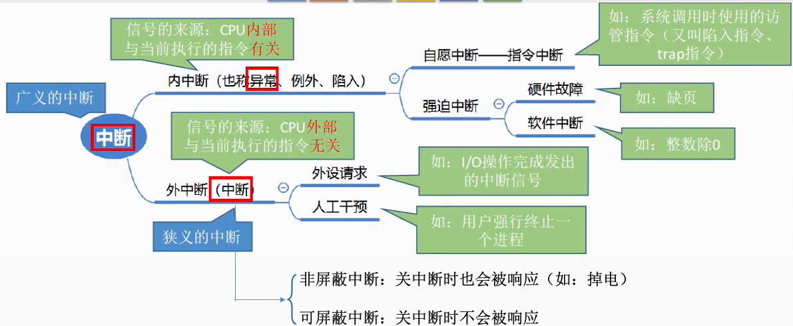

中断判优：硬件（硬件排队器），软件（查询程序）实现。优先级可以按分类部分的内容设置。

#### 2、中断的响应和处理

中断请求标记：每个中断源向CPU发出中断请求的时间是随机的。为了记录中断事件并区分不同的中断源，中断系统需对每个中断源设置**中断请求标记触发器INTR**，当其状态为“1”时，表示中断源有请求。这些触发器可组成中断请求标记寄存器，该寄存器可集中在CPU中，也可分散在各个中断源中。

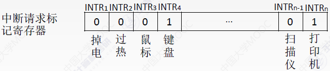

对于外中断，CPU是在统一的时刻即每条指令执行阶段结束前向接口发出中断查询信号以获取l/O的中断请求，也就是说，CPU响应中断的时间是在每条指令执行阶段的结束时刻。

CPU响应中断必须满足以下3个条件：

1. 中断源有中断请求。
2. CPU允许中断即开中断。
3. 一条指令执行完毕，且没有更紧迫的任务。

响应过程：

1. 当前指令执行结束，PC+1，进入中断周期后，CPU扫描发现有中断请求，并通过判优确定响应。
2. 现在，中断隐程序将保留原PC值（断点）。在保留断点期间，有必要进行关中断指令，否则可能会被打断。最后，中断隐指令将中断服务程序引出（设置PC值）。
3. 执行完中断程序后，读出原PC值（断点），继续执行原程序。

上述过程中可以看到**中断隐指令的三大任务：关中断（为安全保存断点）；保存断点；引出中断服务程序。**


为了查找中断服务程序的入口地址并传给PC，有两类办法：即软件查询法和硬件向量法。硬件向量法：

- 对每一条中断请求编号，将这些转移指令保存在主存。这些**指令中的地址称为中断向量**；**指令的地址称为向量地址**。如上图中12H是向量地址，200是向量。
- 将中断判优的硬件排队器的输出传给中断向量地址形成部件，产生向量地址；产生的向量地址也称为**中断类型号**。

中断服务程序的四大任务（与中断隐指令配合）：

1. 保护现场：保存通用寄存器和状态寄存器的内容（eg：保存ACC寄存器的值），以便返回原程序后可以恢复CPU环境。可使用堆栈，也可以使用特定存储单元。
2. 中断服务（设备服务）：主体部分，如通过程序控制需打印的字符代码送入打印机的缓冲存储器中（eg：中断服务的过程中有可能修改ACC寄存器的值）
3. 恢复现场：通过出栈指令或取数指令把之前保存的信息送回寄存器中（eg：把原程序算到一般的ACC值恢复原样）
4. 中断返回：通过中断返回指令回到原程序断点处。此时需要先开中断。


#### 3、多重中断

单重中断：执行中断服务程序时不响应新的中断请求。

多重中断：又称中断嵌套，执行中断服务程序时可响应新的中断请求。需要注意的是，保存断点、现场的过程中不可以被中断，恢复的时候也不可以被中断，只有在中断服务程序内部才可以被中断。

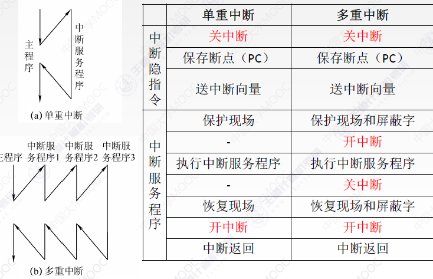

中断屏蔽字：用于屏蔽某些中断，一般会将优先级更低的屏蔽。

- 硬件排队器：对多个中断请求有固定的优先级，只响应其中一个。
- 对排队器增加中断屏蔽功能后，可以灵活调整优先级。**每个中断来源都有一个用于标识的中断屏蔽字**。

中断屏蔽字设置的规律：

1. 一般用‘1'表示屏蔽，'0'表示正常申请。
2. 每个中断源对应一个屏蔽字（在处理该中断源的中断服务程序时，屏蔽寄存器中的内容为该中断源对应的屏蔽字）。
3. 屏蔽字中1越多，优先级越高。每个屏蔽字中至少有一个1（**至少要能屏蔽自身的中断**）。
